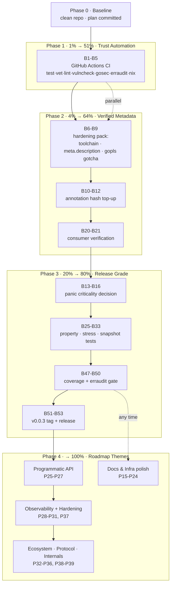

# Pareto Master Execution Plan — go-health

> Created: 2026-09-04 00:02 CEST · Source: TODO_LIST.md (26 verified rows) + status report
> `2026-09-03_23-53` new items + ROADMAP.md (6 themes, 31 raw ideas).
> Scope: **every** open TODO, broken down twice: 30–100 min tasks (Tier A), ≤12 min
> micro-tasks (Tier B). Sorted by importance / impact / effort / customer-value.
>
> **Definition of "result"** for the Pareto math: a *trustworthy, releasable,
> maintainable* library — every push verified by automation, quality gaps closed,
> docs truthful, release cadence unblocked, roadmap themes ready to graduate.
>
> **COMPLETED 2026-09-04** — all 39 P-tasks executed. Phases 1–3 (P1–P24) plus
> P25–P34 in the [11-13 marathon](../status/2026-09-04_11-13_pareto-execution-marathon-and-api-batch.md);
> P35–P39 + P23/P24 + final sweep, CI green, and release v0.1.1 in the
> [13-17 report](../status/2026-09-04_13-17_v011-release-deprecation-and-first-green-ci.md).
> Leftover follow-ups live in TODO_LIST.md / ROADMAP.md.

---

## 1. Pareto Breakdown

| Tier  | Share of work | Cumulative result | What it is                                                                                                   | Why it dominates                                                                                     |
| ----- | ------------- | ----------------- | ------------------------------------------------------------------------------------------------------------ | ---------------------------------------------------------------------------------------------------- |
| **1%**  | P1 (CI)       | **51%**           | GitHub Actions CI running test-race, vet, lint, govulncheck, gosec, erraudit, `nix flake check`               | Seven sessions ran the same gates manually. Automation converts per-session discipline into a permanent property and is the precondition for confident releases. |
| **4%**  | P1–P4         | **64%**           | CI + quick-hardening pack (toolchain directive, flake `meta.description`, gopls gotcha) + annotation hash top-up | Fixes the entire "unverified claims / stale metadata" class; makes every future session's baseline trustworthy. |
| **20%** | P1–P14        | **80%**           | + panic-criticality decision, consumer verification, migration guide, property/stress/snapshot tests, coverage re-run | Closes every *known correctness & trust* gap. After this, the library is release-grade: decisions made, highest-risk test gaps shut, docs verifiable. |
| **Last 20%** | P15–P39 | **100%**          | Fuzz, benchmarks, ADRs, infra configs, docs curation, and all six ROADMAP themes                               | Real value, but each item is incremental polish or future-facing capability — none blocks trust or release. |

**Ordering rule:** 1% → 4% → 20% first (Phases 1–3), then the remaining 20% (Phase 4)
in theme order. Never let Phase 4 polish delay Phase 1–3 trust work.

---

## 2. Tier A — Comprehensive Plan (30–100 min tasks, ALL todos)

| ID  | Task                                                                              | Min  | Impact | Effort | Covers (source)                    |
| --- | --------------------------------------------------------------------------------- | ---- | ------ | ------ | ---------------------------------- |
| P1  | GitHub Actions CI: test-race, vet, lint, govulncheck, gosec, erraudit, nix check   | 100  | High   | M      | TODO High-1, erraudit gate (new)   |
| P2  | Quick-hardening pack: go.mod `toolchain`, flake `meta.description`, gopls gotcha    | 30   | High   | S      | TODO Med-2, Med-4, new gopls row   |
| P3  | Annotation hash top-up in reports `19-01`/`19-11`                                  | 30   | High   | S      | TODO Low (new)                     |
| P4  | Panic-recovery criticality: decide, implement fail-for-critical, test, document    | 60   | High   | M      | TODO Med-3                         |
| P5  | Consumer verification: compile samber-do-auditlog against HEAD, record result      | 30   | Med    | S      | TODO Low                           |
| P6  | Migration guide: `WithPlugin` → `WithHealthRecorder` (+ README/AGENTS links)       | 30   | Med    | S      | TODO Med-1                         |
| P7  | `doanalyzerv2` unblock attempt (nix overlay / build from source)                    | 60   | High   | M      | TODO High-2 (BLOCKED)              |
| P8  | Property-based `classify` test (exhaustive pass/warn/fail matrix)                  | 60   | Med    | M      | TODO Low-1                         |
| P9  | Lifecycle stress tests: Start+Shutdown, Mark+Shutdown, restart-after-shutdown      | 45   | Med    | S      | TODO Low-2, Low-3                  |
| P10 | JSON snapshot/golden test + marshal-error message test                             | 45   | Med    | S      | TODO Low-4, marshal-msg row        |
| P11 | Fuzz tests: json/v2 marshaling + handler input                                     | 60   | Med    | M      | TODO Low-5                         |
| P12 | Startup-handler contention benchmark + baseline numbers                            | 30   | Low    | S      | TODO Low-6                         |
| P13 | README Quick Start → compiled `Example` test, sync docs                            | 30   | Low    | S      | TODO Low-7                         |
| P14 | `//nolint` refactors: err113 sentinel, nonamedreturns removal                      | 30   | Low    | S      | TODO Low-8                         |
| P15 | ADRs ×3: stdlib errors, no logging, three-state classify                           | 60   | Low    | M      | TODO Low-9                         |
| P16 | Coverage re-run, record current %, analyze remaining gap                           | 30   | Low    | S      | TODO Low (new)                     |
| P17 | erraudit local gate: run canonical invocation, add to CONTRIBUTING                 | 30   | Low    | S      | TODO Low (new)                     |
| P18 | v0.0.3: finalize `[Unreleased]`, tag, GitHub release, verify pkg.go.dev            | 30   | Med    | S      | TODO Med-5 (new)                   |
| P19 | renovate or dependabot config                                                      | 30   | Low    | S      | TODO Low-11                        |
| P20 | GitHub issue templates (bug, feature)                                              | 30   | Low    | S      | TODO Low-12                        |
| P21 | `nix flake check --all-systems` verification + fixes                               | 30   | Low    | S      | TODO Low-13                        |
| P22 | CONTRIBUTING testing-strategy section                                              | 30   | Low    | S      | TODO Low-10 (remainder)            |
| P23 | TODO_LIST curation: cap Low at ~8, move infra-noise to ROADMAP                     | 30   | Low    | S      | TODO Low (new)                     |
| P24 | Full read-through verification of all 6 annotated reports                          | 30   | Low    | S      | TODO Low (new)                     |
| P25 | Programmatic API: `Probe.Status()` / `Alive()` / `Ready()` + tests + docs          | 60   | Med    | M      | ROADMAP Theme 1                    |
| P26 | `AwaitReady(ctx)` + `Healthz()` combined endpoint                                  | 60   | Med    | M      | ROADMAP Theme 1                    |
| P27 | Export `healthCheckFunc` + `NewWithHealthCheck(fn, opts...)`                       | 45   | Low    | M      | ROADMAP Theme 1                    |
| P28 | Observability data: per-service latency, `Response.Timestamp`, float64 latency     | 45   | Low    | M      | ROADMAP Theme 2                    |
| P29 | Metrics hooks design + spike (no hard dependency)                                  | 60   | Med    | M      | ROADMAP Theme 2                    |
| P30 | Debounce/throttle for live evaluation mode (DOS protection)                        | 60   | Med    | M      | ROADMAP Theme 3                    |
| P31 | `WithShutdownGracePeriod(d)` automatic two-phase timing                            | 45   | Low    | M      | ROADMAP Theme 3                    |
| P32 | `do.HealthcheckerWithContext` + `do.ShutdownerWithError` on Probe                  | 60   | Med    | M      | ROADMAP Theme 4                    |
| P33 | `HealthRecorder` decoupling ADR (gated on P5 consumer answer)                      | 45   | Med    | M      | ROADMAP Theme 4                    |
| P34 | Extract `classify`/`evaluateStartup` into `classifier` type                        | 45   | Low    | M      | ROADMAP Theme 6                    |
| P35 | Small-options batch: WithNowFunc, WithAllowedMethods, ResetStartupLatch, Status validation, "starting" Status | 60 | Low | M | ROADMAP Themes 5+6 |
| P36 | Format batch: Prometheus exposition, `Response.InstanceID`, OpenAPI                | 60   | Low    | M      | ROADMAP Theme 5                    |
| P37 | Classification 2.0 design notes: weights, circuit-breaker, MaxConcurrent, per-service caching | 45 | Low | S | ROADMAP Themes 2+3 |
| P38 | Multi-tenant batch: child-scope, WithProbeName, WithCriticalService toggle         | 45   | Low    | M      | ROADMAP Theme 4                    |
| P39 | HTTP middleware support for probe endpoints                                        | 45   | Low    | M      | ROADMAP Theme 6                    |

Coverage check: every TODO_LIST row (26), every new status-report item (7), and all
31 ROADMAP raw ideas map to exactly one P-task. Nothing dropped.

---

## 3. Tier B — Micro-Task Breakdown (≤12 min each, ALL todos)

| #   | Task                                                        | Min | Parent | Pri |
| --- | ----------------------------------------------------------- | --- | ------ | --- |
| B1  | Research Actions workflow layout (nix vs toolchain runners)  | 10  | P1     | 1%  |
| B2  | Write `ci.yml`: test-race + vet + lint job                   | 12  | P1     | 1%  |
| B3  | Add security job: govulncheck + gosec                        | 12  | P1     | 1%  |
| B4  | Add erraudit + `nix flake check` jobs                        | 12  | P1     | 1%  |
| B5  | CI badge in README + branch protection notes                 | 10  | P1     | 1%  |
| B6  | Add `toolchain go1.26.7` to go.mod, build                    | 5   | P2     | 4%  |
| B7  | Add `meta.description` to all flake apps                     | 12  | P2     | 4%  |
| B8  | Write gopls/jsonv2 gotcha into AGENTS.md                     | 5   | P2     | 4%  |
| B9  | Run full local gate after P2 changes                         | 10  | P2     | 4%  |
| B10 | Top up hashes in report `19-01`                              | 12  | P3     | 4%  |
| B11 | Top up hashes in report `19-11`                              | 12  | P3     | 4%  |
| B12 | Grep-verify zero date-only verdicts remain                   | 5   | P3     | 4%  |
| B13 | Write panic-criticality decision (short design note)         | 10  | P4     | 20% |
| B14 | Implement decision in runHealthChecks/classify               | 12  | P4     | 20% |
| B15 | Add fail-path test for panicking critical service            | 12  | P4     | 20% |
| B16 | Sync README/FEATURES/AGENTS panic semantics                  | 10  | P4     | 20% |
| B17 | Draft `docs/migration-plugin-to-recorder.md`                 | 12  | P6     | 20% |
| B18 | Link guide from README + AGENTS.md                           | 5   | P6     | 20% |
| B19 | Verify guide examples compile                                | 10  | P6     | 20% |
| B20 | E2E compile test: auditlog module against HEAD               | 12  | P5     | 20% |
| B21 | Record consumer result in FEATURES + AGENTS                  | 5   | P5     | 20% |
| B22 | Research doanalyzerv2 packaging (source, overlay)            | 12  | P7     | 20% |
| B23 | Wire analyzer into flake (overlay input)                     | 12  | P7     | 20% |
| B24 | Run analyzer, record DO-6 verdict, update TODO               | 12  | P7     | 20% |
| B25 | Design classify property matrix (inputs × critical sets)     | 10  | P8     | 20% |
| B26 | Implement exhaustive table-driven property test              | 12  | P8     | 20% |
| B27 | Fill matrix gaps, wire into test suite                       | 12  | P8     | 20% |
| B28 | Stress test: concurrent Start + Shutdown                     | 12  | P9     | 20% |
| B29 | Stress test: MarkShuttingDown + Shutdown two-phase           | 12  | P9     | 20% |
| B30 | Test: Start after Shutdown restart scenario                  | 12  | P9     | 20% |
| B31 | Golden-file harness for readiness JSON                       | 12  | P10    | 20% |
| B32 | Test marshal-error message content                           | 10  | P10    | 20% |
| B33 | Sync FEATURES/AGENTS test inventory                          | 5   | P10    | 20% |
| B34 | Fuzz `json.Marshal(resp, Deterministic)` round-trip          | 12  | P11    | 20% |
| B35 | Fuzz handler input (paths, methods, recorder panics)         | 12  | P11    | 20% |
| B36 | Wire fuzz targets into CI (short run)                        | 5   | P11    | 20% |
| B37 | Write startup contention benchmark                           | 12  | P12    | 80% |
| B38 | Run + record baseline numbers in FEATURES                    | 10  | P12    | 80% |
| B39 | Port README Quick Start into `ExampleProbe`                  | 12  | P13    | 80% |
| B40 | Diff README vs example output, fix drift                     | 10  | P13    | 80% |
| B41 | err113: introduce static sentinel in recovery path           | 12  | P14    | 80% |
| B42 | nonamedreturns: restructure recovery return                  | 12  | P14    | 80% |
| B43 | Remove nolints, run lint + race tests                        | 10  | P14    | 80% |
| B44 | ADR-001: stdlib errors by design                             | 12  | P15    | 80% |
| B45 | ADR-002: zero logging coupling                               | 12  | P15    | 80% |
| B46 | ADR-003: three-state classify                                | 12  | P15    | 80% |
| B47 | Run `nix run .#coverage`, capture number                     | 10  | P16    | 80% |
| B48 | Record % + gap analysis in FEATURES/AGENTS                   | 10  | P16    | 80% |
| B49 | Run `erraudit ./... --type-aware`, capture baseline          | 5   | P17    | 80% |
| B50 | Document gate + baseline in CONTRIBUTING                     | 10  | P17    | 80% |
| B51 | Finalize CHANGELOG `[Unreleased]` for v0.0.3                 | 10  | P18    | 80% |
| B52 | Tag v0.0.3, push, create GitHub release                      | 10  | P18    | 80% |
| B53 | Verify release links + pkg.go.dev indexing                   | 10  | P18    | 80% |
| B54 | Pick renovate vs dependabot, write config                    | 12  | P19    | 100% |
| B55 | Dry-run dependency scan, verify config                       | 10  | P19    | 100% |
| B56 | Issue template: bug report                                   | 10  | P20    | 100% |
| B57 | Issue template: feature request                              | 10  | P20    | 100% |
| B58 | Run `nix flake check --all-systems`                          | 10  | P21    | 100% |
| B59 | Fix any system-specific breakages                            | 12  | P21    | 100% |
| B60 | Write CONTRIBUTING testing-strategy section                  | 12  | P22    | 100% |
| B61 | Verify documented commands actually run                      | 10  | P22    | 100% |
| B62 | Audit all 19 TODO_LIST Low rows for noise                    | 12  | P23    | 100% |
| B63 | Prune/move rows to ROADMAP, re-sort                          | 10  | P23    | 100% |
| B64 | Human read-through of 6 annotated reports                    | 12  | P24    | 100% |
| B65 | Fix any annotation findings                                  | 12  | P24    | 100% |
| B66 | Design `Status()`/`Alive()`/`Ready()` semantics (cache vs live) | 10 | P25 | 100% |
| B67 | Implement `Probe.Status()`                                   | 12  | P25    | 100% |
| B68 | Implement `Alive()` / `Ready()`                              | 10  | P25    | 100% |
| B69 | Table-driven tests for the three accessors                   | 12  | P25    | 100% |
| B70 | README/FEATURES/DOMAIN_LANGUAGE sync                         | 10  | P25    | 100% |
| B71 | Design `AwaitReady` blocking semantics                       | 10  | P26    | 100% |
| B72 | Implement `AwaitReady(ctx)`                                  | 12  | P26    | 100% |
| B73 | Implement `Healthz()` combined handler                       | 12  | P26    | 100% |
| B74 | Tests + docs for both                                        | 12  | P26    | 100% |
| B75 | Design injector-free constructor surface                     | 10  | P27    | 100% |
| B76 | Export type + `NewWithHealthCheck`                           | 12  | P27    | 100% |
| B77 | Tests + example + docs                                       | 12  | P27    | 100% |
| B78 | Add per-service latency to `Check`                           | 12  | P28    | 100% |
| B79 | Add `Response.Timestamp` field                               | 10  | P28    | 100% |
| B80 | Evaluate/apply float64 latency                               | 10  | P28    | 100% |
| B81 | Docs + tests for latency/timestamp                           | 12  | P28    | 100% |
| B82 | Design metrics hook interface (stdlib-only)                  | 12  | P29    | 100% |
| B83 | Implement optional hook, wire into evaluate path             | 12  | P29    | 100% |
| B84 | Tests + docs + non-goal guardrails                           | 12  | P29    | 100% |
| B85 | Design debounce/throttle semantics for live mode             | 10  | P30    | 100% |
| B86 | Implement throttled live evaluation                          | 12  | P30    | 100% |
| B87 | Tests: burst traffic + correctness                           | 12  | P30    | 100% |
| B88 | Docs: configuration reference + FEATURES                     | 10  | P30    | 100% |
| B89 | Design grace-period semantics                                | 10  | P31    | 100% |
| B90 | Implement `WithShutdownGracePeriod`                          | 12  | P31    | 100% |
| B91 | Tests + docs                                                 | 12  | P31    | 100% |
| B92 | Probe `HealthCheckWithContext` conformance                   | 12  | P32    | 100% |
| B93 | Probe `ShutdownerWithError` conformance                      | 12  | P32    | 100% |
| B94 | Self-registration example + docs                             | 12  | P32    | 100% |
| B95 | ADR: recorder decoupling options + recommendation            | 12  | P33    | 100% |
| B96 | Decision gate: consult P5 consumer result                    | 5   | P33    | 100% |
| B97 | Implement chosen signature (if approved)                     | 12  | P33    | 100% |
| B98 | Classifier extraction refactor                               | 12  | P34    | 100% |
| B99 | Re-run race + coverage, confirm no regression                | 12  | P34    | 100% |
| B100| `WithNowFunc` + uptime test                                  | 12  | P35    | 100% |
| B101| `WithAllowedMethods` replacing GET-only bool                 | 12  | P35    | 100% |
| B102| `ResetStartupLatch` (test-scoped)                            | 10  | P35    | 100% |
| B103| Status validation + "starting" Status exploration            | 12  | P35    | 100% |
| B104| Prometheus exposition writer spike                           | 12  | P36    | 100% |
| B105| `Response.InstanceID` + docs                                 | 10  | P36    | 100% |
| B106| OpenAPI schema exploration                                   | 12  | P36    | 100% |
| B107| Weights/priorities design note                               | 12  | P37    | 100% |
| B108| Circuit-breaker + MaxConcurrent design note                  | 12  | P37    | 100% |
| B109| Per-service caching design note                              | 10  | P37    | 100% |
| B110| Child-scope isolation design note                            | 12  | P38    | 100% |
| B111| `WithProbeName` + `WithCriticalService` toggle note          | 12  | P38    | 100% |
| B112| Middleware support design + spike                            | 12  | P39    | 100% |

Coverage check: every P-task decomposed; 112 micro-tasks, all ≤12 min, all 57
source items present.

---

## 4. Execution Graph

**Parallelism:** CI (Phase 1) is independent of the hardening pack — run B1–B5 and
B6–B12 in separate work streams. Phase 4 themes are order-free; P33 is the only
hard gate (needs P5's consumer answer).

---

## 5. Verschlimmbesserer Guards — what NOT to do

1. **No public API change without the consumer answer** (P5 gates P33 and any
   breaking cleanup; ALPHA is not a license for unilateral breaks — see 19-11 d1).
2. **No new module dependencies** — stdlib + `samber/do/v2` only (ROADMAP non-goal).
3. **No weakening `.golangci.yml` to make CI green** — fix the code, not the linter.
4. **No rewriting historical reports** — only inline annotation (`done at hash`).
5. **No logging, no error library, no per-service timeout** — settled non-goals.
6. **Gates after every task**: `nix run .#test` minimum; full gate before any release.
7. **JSON wire format is frozen** — any serialization change must keep sorted keys
   (`json.Deterministic(true)`) and pass `TestReadiness_JSONChecksAreSortedAlphabetically`.

## 6. Definition of Done (per task)

- [ ] Code/docs change committed with a message a stranger understands
- [ ] `nix run .#test` green (race detector on touched packages)
- [ ] `nix run .#lint` 0 issues · `nix fmt` 0 changed
- [ ] Affected living docs (FEATURES/TODO_LIST/AGENTS/README/CHANGELOG) updated in
      the same commit — no drift allowed to accumulate
