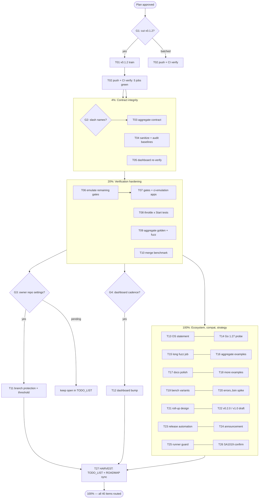

# Pareto Master Plan v2 — Ship the Fix, Lock the Contract, Harden Verification

**Created:** 2026-09-04 19:34 CEST · **Status:** PLANNED — execution starts after owner approval
**Input universe:** 40 work items = 34 from status report `2026-09-04_19-25` §(f) + 6 carried blocked/strategy items
**Method:** Pareto tiers (1% → 4% → 20% → 100%) × two granularity levels (27 medium tasks of 30–100 min → 86 micro tasks of ≤12 min)

> Verschlimmbesser guards: every task below is **additive or decision-gated**; none touches the frozen wire format, the three-probe contract, or the v0.x no-removal deprecation promise. Every code task ends in the full gate sweep (`test-race · vet · lint · fmt · flake check`). Decision gates (G) halt for owner input instead of guessing.

---

## Step 1 — Pareto Breakdown

### 🎯 1% that delivers 51% — "Ship the fix, prove CI"

The instance_id UTF-8 bug is **live in released v0.1.1**: any consumer whose replica ID contains invalid UTF-8 gets HTTP 500 on every health endpoint. Nothing else on this list matters until the fix is shipped and the pipeline that verifies it (5 CI jobs, incl. the new openapi job) has proven green once.

| Tier | Tasks | Why it is 51% |
| ---- | ----- | ------------- |
| 1% | **T01** v0.1.2 release train (decision-gated) · **T02** push master + all 5 CI jobs green | Removes a released data-path bug; establishes the CI baseline every later task rides on. ~2/27 tasks ≈ 1/25th of the total effort, majority of user-facing value. |

### 🎯 4% that delivers 64% — "Lock the API contract"

+ **T03** aggregate slash-name decision & fix · **T04** sanitize regression test + nolint-audit baseline · **T05** dashboard consumer re-verification. These three close the contract-integrity gaps a downstream consumer would hit next; cumulative ≈ 5 tasks.

### 🎯 20% that delivers 80% — "Prove it, don't promise it"

+ **T06–T10**: emulated full gate coverage, `.#gates`/`.#ci-emulation` apps (kill the copy-paste drift), test-backed README throttle paragraph, aggregate golden + never-started fuzz, merge benchmark baseline. Cumulative ≈ 10 tasks. Everything here converts "documented claims" into "CI-verified invariants".

### 🧩 Remaining 20% → 100%

+ **T11–T27**: ecosystem unblocks (branch protection, dashboard bump), compatibility statements (OS, Go 1.27), example/docs polish, benchmarks, strategy notes (v0.2.0, v1.0, release automation, announcement), and the post-approval TODO_LIST/ROADMAP harvest. These are real but none blocks a consumer today.

---

## Step 2 — Comprehensive Plan (27 medium tasks, 30–100 min)

Sorted by importance/impact/effort/customer-value. **G** = decision gate (stops for owner). All code tasks include the gate sweep in their definition of done.

| # | Task | Tier | Impact | Effort | Customer value | Depends on |
| - | ---- | ---- | ------ | ------ | -------------- | ---------- |
| T01 | **v0.1.2 release train**: cut CHANGELOG `[Unreleased]` → `0.1.2`, go.mod hygiene, full gates, annotated tag, GitHub release, proxy + pkg.go.dev verify | 1% | Critical | 60min | Bug fix reaches consumers | **G1: owner approves release** |
| T02 | **Push master + verify CI**: all 5 jobs green (test-race+fuzz, vet+lint, security, flake, openapi) | 1% | Critical | 30min | Trust in every future contribution | T01 (tag ride) or standalone |
| T03 | **Aggregate slash-name contract**: decision note → `New()` validation or documented leniency → tests → fuzz skip-contract sync → README | 4% | High | 90min | Prevents silent check-key aliasing | **G2: owner picks strict/lenient** |
| T04 | **Sanitize + audit baselines**: named instance_id regression test; re-run `erraudit nolint-audit .`; refresh CONTRIBUTING baseline | 4% | High | 45min | Regression-proof the 500 bug fix | — |
| T05 | **Consumer re-verification**: go-health-dashboard replace-build vs HEAD + test run + evidence note | 4% | High | 45min | Keeps the only known consumer honest | — |
| T06 | **Emulate remaining gates** (test-race, fuzz, flake check) under go-free PATH; record results | 20% | Medium | 60min | "green locally = green on CI" becomes proven | — |
| T07 | **`.#gates` + `.#ci-emulation` flake apps**: one-command pre-push sweep w/ pipefail; CONTRIBUTING copy-paste replaced | 20% | Medium | 90min | Kills gate-drift class of failures permanently | T06 |
| T08 | **Throttle × Start test**: loop-refreshed cache under `WithLiveThrottle` — make the README paragraph test-backed | 20% | Medium | 45min | Documented behavior can't silently rot | — |
| T09 | **Aggregate golden + fuzz extension**: merged-body golden snapshot; never-started source probe merge case | 20% | Medium | 60min | Locks aggregate wire shape + zero-cache path | — |
| T10 | **Aggregate merge benchmark** (N=1,2,4,8 sources) + FEATURES baseline | 20% | Medium | 45min | Merge cost becomes a tracked number | — |
| T11 | **Policy applications**: branch protection (5 checks + linear); coverage threshold job if approved | 20% | High | 30min | Repo stops accepting broken commits | **G3: owner/admin settings** |
| T12 | **Dashboard bump execution** (drop replace, v0.1.2) | 20% | High | 30min | First real downstream on released version | G1 + **G4: repo cadence** |
| T13 | **OS support statement**: README matrix row (linux/amd64 tested; darwin/windows untested) or CI matrix job if approved | 100% | Medium | 45min | Honest compatibility claims | — |
| T14 | **Go 1.27 compat probe**: build+test without GOEXPERIMENT; update AGENTS/CONTRIBUTING gotchas | 100% | Medium | 60min | Future-proof json/v2 story | go1.27 availability |
| T15 | **Long-budget fuzz job**: weekly scheduled workflow, 5 min/target | 100% | Medium | 45min | Catches slow-burn fuzz regressions | — |
| T16 | **Aggregate godoc examples**: ExampleNew, merge, startup-latch | 100% | Medium | 60min | Sub-package discoverability on pkg.go.dev | — |
| T17 | **Docs polish**: README aggregate scalar-drop note; AGENTS fuzz-corpus gotcha; ROADMAP seam-extraction rejection note | 100% | Low | 45min | Non-obvious context survives sessions | — |
| T18 | **Examples**: `ExampleWithShutdownGracePeriod`, `ExampleProbe_AsShutdowner` | 100% | Low | 45min | Drain + do-integration discoverability | — |
| T19 | **Benchmark variants**: HEAD-allowed guard, Allow-header build cost | 100% | Low | 30min | Method-set cost fully characterized | — |
| T20 | **errors.Join spike** for `aggregate.New` multi-error reporting → ADR/ROADMAP note | 100% | Low | 30min | Better construction errors, decided not vibes | — |
| T21 | **Per-source roll-up design note** (aggregate observability) → ROADMAP | 100% | Low | 60min | Future feature has a written design | — |
| T22 | **Strategy: v0.2.0 scope + v1.0 criteria draft** → ROADMAP | 100% | Low | 90min | Road out of v0.x is written | — |
| T23 | **Release-automation evaluation** (GoReleaser vs manual) → decision note | 100% | Low | 60min | Release toil shrinks | — |
| T24 | **v0.1.1/v0.1.2 announcement draft** + channels | 100% | Low | 30min | Project visibility | T01 |
| T25 | **Runner path guard**: env-overridable replace target + actionable error in tools/doanalyzerv2 | 100% | Low | 30min | Runner survives machine migrations | — |
| T26 | **SA1019 policy formalized** (confirm deprecation-policy stance in TODO_LIST decision row) | 100% | Low | 30min | Lint policy no longer ambiguous | **G5: confirm** |
| T27 | **HARVEST**: sync TODO_LIST (actionables) + ROADMAP (strategy) from this plan; close plan items | 100% | Medium | 30min | Single source of truth restored | all above |

---

## Step 3 — Detailed Breakdown (86 micro tasks, each ≤ 12 min)

| ID | Micro task (≤12min) | Parent |
| -- | ------------------- | ------ |
| **M1 — Ship & verify (1%)** | | |
| 1.1 | G1: owner decision — cut v0.1.2 now vs batch | T01 |
| 1.2 | Rewrite CHANGELOG `[Unreleased]` → `[0.1.2] - <date>`, keep Added/Fixed split | T01 |
| 1.3 | go.mod hygiene: no replace/pseudo-versions, `go mod verify` | T01 |
| 1.4 | Pre-release gate sweep: test-race + vet + lint + fmt + flake check | T01 |
| 1.5 | Annotated tag `v0.1.2` + push commit & tag | T01 |
| 1.6 | GitHub release (not prerelease) + verify proxy + pkg.go.dev | T01 |
| 2.1 | Push master; open Actions run | T02 |
| 2.2 | Watch 5 jobs; triage any red to root cause | T02 |
| 2.3 | Reproduce any red locally (emulated PATH if gate shells to go), fix, re-push | T02 |
| **M2 — Contract integrity (4%)** | | |
| 3.1 | G2: owner decision — reject "/" names vs document leniency | T03 |
| 3.2 | Write decision note in `docs/` (aliasing example included) | T03 |
| 3.3 | Implement chosen path in `aggregate.New` (validation or doc-only) | T03 |
| 3.4 | Unit tests: rejection path or documented-leniency assertions | T03 |
| 3.5 | Sync fuzz skip-contract + doc comments to the decision | T03 |
| 3.6 | README aggregate section update + gate sweep | T03 |
| 4.1 | Named unit test: `SanitizeResponse` coerces `InstanceID` | T04 |
| 4.2 | Run `erraudit nolint-audit .`; capture result | T04 |
| 4.3 | Refresh CONTRIBUTING nolint-audit baseline text | T04 |
| 5.1 | Update/pull go-health-dashboard checkout | T05 |
| 5.2 | Replace-directive build against HEAD; record exit 0 | T05 |
| 5.3 | Run dashboard tests; append evidence to AGENTS consumer note | T05 |
| **M3 — Verification hardening (20%)** | | |
| 6.1 | Recreate temp-bin PATH env (nix + gcc symlinks) | T06 |
| 6.2 | Emulate `nix run .#test-race`; record | T06 |
| 6.3 | Emulate `nix run .#fuzz` (3 targets); record | T06 |
| 6.4 | Emulate `nix flake check`; record | T06 |
| 6.5 | Write results into CONTRIBUTING emulation section | T06 |
| 7.1 | Draft `.#gates` app: pipefail loop over all gates, fail-fast | T07 |
| 7.2 | Draft `.#ci-emulation` app: temp-bin PATH wrapper | T07 |
| 7.3 | Run `.#gates` end-to-end; fix app issues | T07 |
| 7.4 | Run `.#ci-emulation` end-to-end; fix app issues | T07 |
| 7.5 | Replace CONTRIBUTING copy-paste recipes with app invocations | T07 |
| 7.6 | `nix fmt` + `nix flake check` | T07 |
| 8.1 | Test: `Start` (1s refresh) + `WithLiveThrottle` ⇒ requests trigger zero batches | T08 |
| 8.2 | Test: stored result older than window ⇒ exactly one evaluation | T08 |
| 8.3 | Link tests from README throttle paragraph; gate sweep | T08 |
| 9.1 | Aggregate readiness golden: build fixture, write `testdata` golden | T09 |
| 9.2 | Golden assertion test (regenerate flag, like root) | T09 |
| 9.3 | Fuzz: add never-started probe source case; update expected-fold | T09 |
| 9.4 | Run fuzz seeds + 30s live fuzz; gate sweep | T09 |
| 10.1 | `BenchmarkAggregateCachedResponse` with N=1,2,4,8 started sources | T10 |
| 10.2 | Run `-benchtime=1s -count=3`; medians into FEATURES | T10 |
| 10.3 | Gate sweep | T10 |
| **M4 → 100%** | | |
| 11.1 | G3: branch protection via `gh api` (5 checks + linear history) | T11 |
| 11.2 | G3: coverage-threshold job if approved (fail < 97%) | T11 |
| 12.1 | G4: dashboard `go.mod` bump + drop replace | T12 |
| 12.2 | Dashboard build + tests; note in AGENTS | T12 |
| 13.1 | README matrix: OS row (tested linux/amd64 only) | T13 |
| 13.2 | Optional CI OS-matrix: decision note (cost vs value) | T13 |
| 14.1 | Probe go1.27 toolchain availability | T14 |
| 14.2 | Build + full tests without `GOEXPERIMENT=jsonv2` | T14 |
| 14.3 | Update AGENTS/CONTRIBUTING GOEXPERIMENT notes to per-version truth | T14 |
| 14.4 | Flake: keep pinned default; document dual-version stance | T14 |
| 15.1 | Draft `.github/workflows/fuzz-long.yml` (weekly cron, 5min/target) | T15 |
| 15.2 | Concurrency + timeout + SARIF-less output decision | T15 |
| 15.3 | Local dry-run of the workflow commands | T15 |
| 16.1 | `aggregate/example_test.go`: `ExampleNew` happy path | T16 |
| 16.2 | `ExampleAggregate_CachedResponse` merge/worst-of | T16 |
| 16.3 | `ExampleAggregate_StartupHandler` latch behavior | T16 |
| 16.4 | Run examples, `nix fmt`, lint | T16 |
| 17.1 | README: aggregate drops version/instance_id/uptime — one paragraph | T17 |
| 17.2 | AGENTS gotcha: fuzz signature changes invalidate testdata corpus | T17 |
| 17.3 | ROADMAP: marshal-seam package extraction rejected + why | T17 |
| 18.1 | `ExampleWithShutdownGracePeriod` (drain window observable) | T18 |
| 18.2 | `ExampleProbe_AsShutdowner` (do registration) | T18 |
| 18.3 | Run examples + fmt + lint | T18 |
| 19.1 | Benchmarks: HEAD-allowed guard; Allow-header build cost | T19 |
| 19.2 | Record baselines in FEATURES Performance | T19 |
| 20.1 | Spike: `errors.Join` output shape for multiple invalid sources | T20 |
| 20.2 | Decision note (adopt now / defer) → ROADMAP or ADR | T20 |
| 21.1 | Design note: per-source roll-up visibility (shape, opt-in) | T21 |
| 21.2 | Rejected-alternatives section (labels vs checks vs map) | T21 |
| 21.3 | Link from AGENTS docs table → ROADMAP status | T21 |
| 21.4 | Read-through: no contract conflicts with three-probe model | T21 |
| 22.1 | v0.2.0 candidate scope list from open f-items | T22 |
| 22.2 | v1.0 criteria draft (API freeze, compat promises, deprecation rule) | T22 |
| 22.3 | ROADMAP restructure: themes → candidates with status | T22 |
| 22.4 | Cross-link TODO_LIST ↔ ROADMAP | T22 |
| 23.1 | Evaluate GoReleaser vs manual tag flow (criteria: 2 releases/yr) | T23 |
| 23.2 | Decision note with adopted/rejected rationale | T23 |
| 23.3 | Optional: scaffold config, don't wire CI without approval | T23 |
| 24.1 | Announcement draft (v0.1.1 + v0.1.2 highlights) | T24 |
| 24.2 | Channels list (GitHub Discussions, README badge, socials) | T24 |
| 25.1 | `GO_HEALTH_BRANCHING_FLOW` env override + missing-path error in runner | T25 |
| 25.2 | Manual test: override works; missing path prints actionable error | T25 |
| 26.1 | G5: record SA1019 confirmation in deprecation-policy + close TODO decision row | T26 |
| 27.1 | HARVEST: actionable plan items → TODO_LIST (open only) | T27 |
| 27.2 | HARVEST: strategy/design items → ROADMAP; close plan | T27 |

**Totals:** 27 medium tasks ≈ **1,665 min (27.8 h)** · 86 micro tasks · 5 decision gates (G1–G5).

---

## Execution Graph

---

## Anti-Verschlimmbesser Checklist

- [ ] Wire format (`readiness_response.golden`, aggregate golden when added) — frozen; changes only with explicit changelog callout
- [ ] Three-probe contract, liveness-always-200, fail-closed panics — untouched
- [ ] Deprecation promise (`WithGETOnly` lives through v0.x) — untouched
- [ ] Public API changes only via decision gates G2/G3 and changelog + FEATURES updates
- [ ] Every code task ends with the full gate sweep; no half-green commits
- [ ] TODO_LIST stays open-items-only; completed work moves to CHANGELOG
