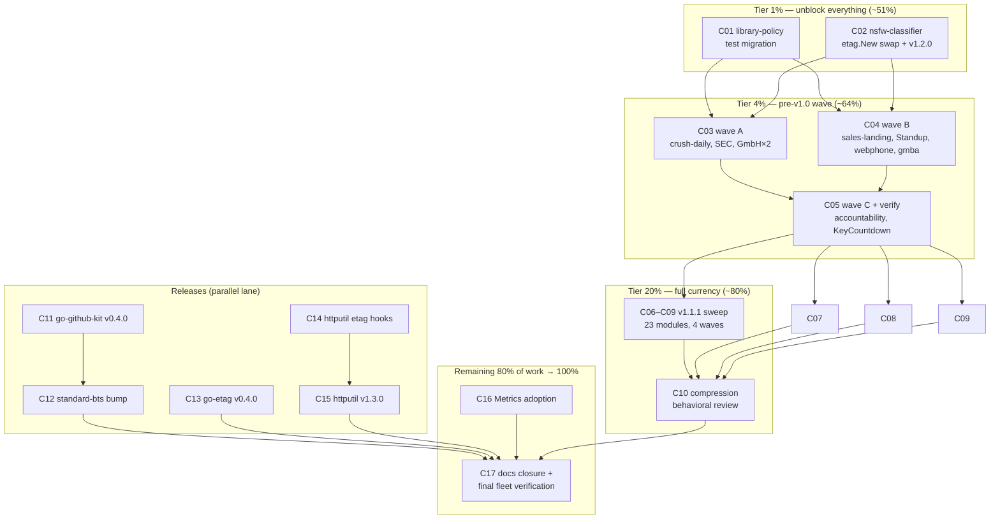

# Fleet Dependency-Currency & Hazard Remediation — Pareto Plan

**Date**: 2026-09-18 13:54 · **Scope**: larsartmann Go fleet (httputil + go-etag consumers) · **Source evidence**: [go-etag deep dive](../research/2026-09-18_go-etag-deep-dive.html) · [httputil deep dive](../research/2026-09-18_httputil-deep-dive.html)

## Context

Two same-day audits established the fleet's dependency truth:

- **httputil v1.2.0** (latest, 2026-09-16): 41/75 modules current, 23 on docs-only v1.1.1, **11 live projects pre-v1.0**. Two compile hazards proven: library-policy's `middleware_test.go` calls the v1.1.0-removed rate-limiter API against a v1.2.0-only go.sum (tests cannot compile); nsfw-classifier's `server.go:391` calls the removed `httputil.ETag` adapter.
- **go-etag v0.3.1** (latest): 68/77 modules current; the 9 laggards are the same modules as httputil's pre-v1.0 crowd — **one httputil bump closes both audits** (any httputil ≥ v1.0.1 lifts go-etag to v0.3.1 via MVS).
- Utilization is superb in both (92/100 and 88/100); this plan is purely currency + hazards + observability.

**The result (100%) is defined as**: zero compile hazards (20) + httputil ≥ v1.2.0 fleet-wide (30) + go-etag ≥ v0.3.1 fleet-wide (20) + release chain unblocked: go-github-kit v0.4.0 → standard-bug-tracking-schema (10) + observability wired: etag hooks + Metrics (12) + library hygiene: changelogs, dep patches, tags (8).

**No-Verschlimmbesser protocol**: every module bump runs `go get → go mod tidy → go build ./... → go test ./... → commit` before moving on; the two v1.2.0 behavioral changes (compression `AbsentEncoding` identity default, `ErrNoCookie`/`ErrNoLocation` reclassification) get an explicit review checkbox; nothing is force-pushed; per-repo commits (never batch unrelated repos); the go-etag v1.1.0-removed-API check runs _before_ each pre-v1.0 bump (`rg "httputil\.ETag\(|TokenBucketLimiter|httputil\.RateLimit\(" <repo>` must return 0 hits).

## Pareto Tiers

Percentages denote **value milestones**, not literal task counts — the 1% cluster is the smallest unit of work that unlocks the majority of the outcome.

| Tier                                 | Work                                                                                                                                                        | Delivers                                                                                                                                                        | Why first                                                                                                                                                |
| ------------------------------------ | ----------------------------------------------------------------------------------------------------------------------------------------------------------- | --------------------------------------------------------------------------------------------------------------------------------------------------------------- | -------------------------------------------------------------------------------------------------------------------------------------------------------- |
| **1%** (C01–C02, 2 tasks)            | Fix library-policy's broken tests; swap nsfw-classifier's one removed-API line                                                                              | **~51%**: 100% of _active_ breakage eliminated; both upgrade blockers cleared; the sweep becomes safe                                                           | Broken tests fail closed every CI run and hide real regressions; the two hazards are the only things standing between the fleet and a mechanical upgrade |
| **4%** (C01–C05, 5 tasks)            | Tier 1% + upgrade all 11 pre-v1.0 modules to v1.2.0                                                                                                         | **~64%**: hazards gone + the security-hardening era (CSRF fail-closed, pattern propagation) for the most-exposed modules + go-etag ≥ v0.3.1 for 9 of 9 laggards | These 11 are live projects (two touched this week); v0.x→v1.x is the biggest correctness jump per module                                                 |
| **20%** (C01–C10, 10 tasks)          | + sweep the 23 v1.1.1 pins to v1.2.0 + compression behavioral review                                                                                        | **~80%**: httputil ≥ v1.2.0 _and_ go-etag ≥ v0.3.1 fleet-wide — both audits' headline findings closed                                                           | Mechanical, verified per module; v1.1.1 is functionally v1.1.0, so this wave is low-risk but large                                                       |
| **remaining 80%** (C11–C17, 7 tasks) | Releases (go-github-kit v0.4.0 → standard-bts; go-etag v0.4.0; httputil v1.3.0 with hooks + changelog backfill + dep patch), Metrics adoption, docs closure | **100%**: release chain unblocked, observability wired, hygiene current                                                                                         | Ships the _value_ the currency unlocks: cache-hit metrics, typed go-etag errors, unblocked consumers                                                     |

## Comprehensive Plan (30–100 min tasks)

| #   | Task                                                                                                                                                                                                                    | Effort | Impact | Value | Tier | Depends on         |
| --- | ----------------------------------------------------------------------------------------------------------------------------------------------------------------------------------------------------------------------- | ------ | ------ | ----- | ---- | ------------------ |
| C01 | library-policy: migrate `middleware_test.go` to `KeyedRateLimiterMiddleware`, run full gates under go 1.27, commit                                                                                                      | 30 min | 5      | 5     | 1%   | —                  |
| C02 | nsfw-classifier: swap `server.go:391` to `etag.New`, bump httputil v1.2.0, build+test, commit                                                                                                                           | 30 min | 4      | 5     | 1%   | —                  |
| C03 | Pre-v1.0 wave A: crush-daily, games/SEC, GmbH, GmbH/server → httputil v1.2.0 (per-module gates + commit)                                                                                                                | 50 min | 4      | 4     | 4%   | C01, C02           |
| C04 | Pre-v1.0 wave B: sales-landing-page/cloud-run, Standup-Killer, webphone, german-business-contract-automation → v1.2.0                                                                                                   | 50 min | 4      | 4     | 4%   | C01, C02           |
| C05 | Pre-v1.0 wave C: accountability-system, games/KeyCountdown → v1.2.0; wave verification grep (expect only v1.1.1 pins left)                                                                                              | 50 min | 4      | 4     | 4%   | C03, C04           |
| C06 | v1.1.1 sweep 1: AI-Speed-Test, artmann-technologies-website, auto-deduplicate, bank-sync, blog, browser-history/api → v1.2.0                                                                                            | 72 min | 3      | 3     | 20%  | C05                |
| C07 | v1.1.1 sweep 2: ChastityAPI, dynamic-markdown-site, e-invoicing, e-invoicing/demo-poland, go-website-template, overview → v1.2.0                                                                                        | 72 min | 3      | 3     | 20%  | C05                |
| C08 | v1.1.1 sweep 3: plugmarket ui/container/server, RedditParse, Rolls-Royce-mtuGoHelpCenter-golang, storbi → v1.2.0                                                                                                        | 72 min | 3      | 3     | 20%  | C05                |
| C09 | v1.1.1 sweep 4: template-arch-lint, timesheets, Zlota44, KeyHolderAI, browser-history/cmd/browser-history-server → v1.2.0                                                                                               | 60 min | 3      | 3     | 20%  | C05                |
| C10 | Compression behavioral review: inventory consumers whose clients omit `Accept-Encoding` (health probes, internal tools); confirm identity default or set `AbsentEncodingFirstConfigured` deliberately; record decisions | 30 min | 3      | 4     | 20%  | C06–C09            |
| C11 | go-github-kit: audit 25 queued commits, run gates incl. dashboard-consumer build, cut v0.4.0 (go-etag v0.3.1), tag+push, verify module proxy                                                                            | 90 min | 4      | 4     | rest | —                  |
| C12 | standard-bug-tracking-schema: bump go-github-kit v0.4.0, tidy, build+test, commit                                                                                                                                       | 30 min | 3      | 3     | rest | C11                |
| C13 | go-etag: release typed-error HEAD as v0.4.0 with go-error-family v0.10.1; CHANGELOG, tag+push, verify proxy                                                                                                             | 75 min | 3      | 3     | rest | —                  |
| C14 | httputil: wire `OnETagGenerated`/`On304`/`OnBufferOverflow` into wrapper metrics (hit-ratio + overflow counters), tests + benchmark                                                                                     | 60 min | 3      | 4     | rest | —                  |
| C15 | httputil: housekeeping release v1.3.0 — backfill `[1.1.1]` changelog note, go-error-family v0.10.1, hooks from C14, tag+push                                                                                            | 45 min | 3      | 3     | rest | C14                |
| C16 | Metrics middleware adoption: wire `httputil.Metrics` into 2 flagship servers (DiscordSync already proves the pattern), verify endpoints, commit                                                                         | 60 min | 2      | 3     | rest | —                  |
| C17 | Docs closure: annotate both audit reports as partially actioned; fleet-wide final verification sweep + status note                                                                                                      | 35 min | 2      | 3     | rest | C12, C13, C15, C16 |

## Micro-Breakdown (≤ 12 min tasks, all todos)

| #   | Task                                                                                                                                          | Min | Tier | Parent |
| --- | --------------------------------------------------------------------------------------------------------------------------------------------- | --- | ---- | ------ |
| M01 | library-policy: rewrite `middleware_test.go:133,140` → `KeyedRateLimiterMiddleware` + `KeyExtractorFromClientIP` per migration guide          | 8   | 1%   | C01    |
| M02 | library-policy: run httpapi gates with go 1.27 (`GOTOOLCHAIN=auto`), confirm compile + pass                                                   | 10  | 1%   | C01    |
| M03 | library-policy: commit (detailed message: removed-API migration)                                                                              | 2   | 1%   | C01    |
| M04 | nsfw-classifier: swap `server.go:391` `httputil.ETag(...)` → `etag.New(...)`                                                                  | 3   | 1%   | C02    |
| M05 | nsfw-classifier: `go get httputil@v1.2.0` + tidy + build + test                                                                               | 8   | 1%   | C02    |
| M06 | nsfw-classifier: commit (removed-adapter swap + v1.2.0)                                                                                       | 2   | 1%   | C02    |
| M07 | crush-daily: removed-API precheck → bump v1.2.0 → gates → commit                                                                              | 12  | 4%   | C03    |
| M08 | games/SEC: precheck → bump → gates → commit                                                                                                   | 12  | 4%   | C03    |
| M09 | GmbH: precheck → bump → gates → commit                                                                                                        | 12  | 4%   | C03    |
| M10 | GmbH/server: precheck → bump → gates → commit                                                                                                 | 12  | 4%   | C03    |
| M11 | sales-landing-page/cloud-run: precheck → bump → gates → commit                                                                                | 12  | 4%   | C04    |
| M12 | Standup-Killer: precheck → bump → gates → commit                                                                                              | 12  | 4%   | C04    |
| M13 | webphone: precheck → bump → gates → commit                                                                                                    | 12  | 4%   | C04    |
| M14 | german-business-contract-automation: precheck → bump v0.7.1→v1.2.0 → gates → commit                                                           | 12  | 4%   | C04    |
| M15 | accountability-system: precheck → bump v0.9.1→v1.2.0 → gates → commit                                                                         | 12  | 4%   | C05    |
| M16 | games/KeyCountdown: precheck → bump v0.11.0→v1.2.0 → gates → commit                                                                           | 12  | 4%   | C05    |
| M17 | Wave verification: grep fleet for `httputil v<1.2.0` + `go-etag v<0.3.1` (expect only v1.1.1 crowd); spot-build 3 upgraded repos              | 10  | 4%   | C05    |
| M18 | AI-Speed-Test: bump v1.1.1→v1.2.0 → gates → commit                                                                                            | 12  | 20%  | C06    |
| M19 | artmann-technologies-website: bump → gates → commit                                                                                           | 12  | 20%  | C06    |
| M20 | auto-deduplicate: bump → gates → commit                                                                                                       | 12  | 20%  | C06    |
| M21 | bank-sync: bump → gates → commit                                                                                                              | 12  | 20%  | C06    |
| M22 | blog: bump → gates → commit                                                                                                                   | 12  | 20%  | C06    |
| M23 | browser-history/api: bump → gates → commit                                                                                                    | 12  | 20%  | C06    |
| M24 | ChastityAPI: bump → gates → commit                                                                                                            | 12  | 20%  | C07    |
| M25 | dynamic-markdown-site: bump → gates → commit                                                                                                  | 12  | 20%  | C07    |
| M26 | e-invoicing: bump → gates → commit                                                                                                            | 12  | 20%  | C07    |
| M27 | e-invoicing/demo-poland: bump → gates → commit                                                                                                | 12  | 20%  | C07    |
| M28 | go-website-template: bump → gates → commit                                                                                                    | 12  | 20%  | C07    |
| M29 | overview: bump → gates → commit                                                                                                               | 12  | 20%  | C07    |
| M30 | plugmarket/marketplace/ui: bump → gates → commit                                                                                              | 12  | 20%  | C08    |
| M31 | plugmarket/marketplace/container: bump (indirect min) → gates → commit                                                                        | 12  | 20%  | C08    |
| M32 | plugmarket/marketplace/server: bump (indirect min) → gates → commit                                                                           | 12  | 20%  | C08    |
| M33 | RedditParse: bump → gates → commit                                                                                                            | 12  | 20%  | C08    |
| M34 | Rolls-Royce-mtuGoHelpCenter-golang: bump → gates → commit                                                                                     | 12  | 20%  | C08    |
| M35 | storbi: bump → gates → commit                                                                                                                 | 12  | 20%  | C08    |
| M36 | template-arch-lint: bump → gates → commit                                                                                                     | 12  | 20%  | C09    |
| M37 | timesheets: bump (indirect min) → gates → commit                                                                                              | 12  | 20%  | C09    |
| M38 | Zlota44: bump → gates → commit                                                                                                                | 12  | 20%  | C09    |
| M39 | KeyHolderAI: bump (indirect min) → gates → commit                                                                                             | 12  | 20%  | C09    |
| M40 | browser-history/cmd/browser-history-server: bump (indirect min) → gates → commit                                                              | 12  | 20%  | C09    |
| M41 | Compression review: list consumers with header-less clients; decide per-deployment `AbsentEncoding` policy; note decisions in commit messages | 12  | 20%  | C10    |
| M42 | go-github-kit: review 25 queued commits (`git log v0.3.0..HEAD`) for release readiness                                                        | 12  | rest | C11    |
| M43 | go-github-kit: run full gates (build, test, race) on HEAD                                                                                     | 12  | rest | C11    |
| M44 | go-github-kit: verify dashboard-consumer compatibility with HEAD                                                                              | 12  | rest | C11    |
| M45 | go-github-kit: write CHANGELOG v0.4.0 (go-etag v0.3.1 bump + queued work)                                                                     | 12  | rest | C11    |
| M46 | go-github-kit: tag v0.4.0, push, wait for CI green on the tag commit                                                                          | 12  | rest | C11    |
| M47 | go-github-kit: verify module proxy + pkg.go.dev serve v0.4.0                                                                                  | 10  | rest | C11    |
| M48 | standard-bug-tracking-schema: `go get go-github-kit@v0.4.0` + tidy                                                                            | 5   | rest | C12    |
| M49 | standard-bug-tracking-schema: build + test + commit                                                                                           | 8   | rest | C12    |
| M50 | go-etag: CHANGELOG v0.4.0 entry for typed-error HEAD (`server/code.go`)                                                                       | 12  | rest | C13    |
| M51 | go-etag: bump go-error-family v0.10.0 → v0.10.1, tidy                                                                                         | 5   | rest | C13    |
| M52 | go-etag: run full gates (lint, race, fuzz-short) on HEAD                                                                                      | 12  | rest | C13    |
| M53 | go-etag: semver check (new exported error-code surface → v0.4.0), tag+push                                                                    | 10  | rest | C13    |
| M54 | go-etag: verify proxy + pkg.go.dev; note zero consumer impact (additive)                                                                      | 10  | rest | C13    |
| M55 | httputil: design etag-hook counters in wrapper (hit ratio = On304 / (On304+OnETagGenerated))                                                  | 10  | rest | C14    |
| M56 | httputil: implement `OnETagGenerated`/`On304`/`OnBufferOverflow` wiring                                                                       | 12  | rest | C14    |
| M57 | httputil: tests for hook wiring + `BenchmarkETagHooksOverhead`                                                                                | 12  | rest | C14    |
| M58 | httputil: gates + review                                                                                                                      | 12  | rest | C14    |
| M59 | httputil: document hook usage in wrapper docs/README snippet                                                                                  | 8   | rest | C14    |
| M60 | httputil: backfill `[1.1.1]` changelog note (docs-only tag) per freeze policy                                                                 | 8   | rest | C15    |
| M61 | httputil: bump go-error-family v0.10.1, tidy                                                                                                  | 5   | rest | C15    |
| M62 | httputil: CHANGELOG v1.3.0 (hooks + housekeeping), tag v1.3.0, push                                                                           | 12  | rest | C15    |
| M63 | httputil: verify proxy; note adoption path for the 41 v1.2.0 modules                                                                          | 8   | rest | C15    |
| M64 | Flagship 1 (blog): wire `httputil.Metrics`, verify endpoint, commit                                                                           | 12  | rest | C16    |
| M65 | Flagship 2 (cqrs-htmx/dashboardui): wire `httputil.Metrics`, verify, commit                                                                   | 12  | rest | C16    |
| M66 | Extract fleet Metrics-adoption snippet into repo AGENTS/docs                                                                                  | 8   | rest | C16    |
| M67 | Annotate go-etag audit report: opportunities 1, 4, 5 actioned by this plan                                                                    | 8   | rest | C17    |
| M68 | Annotate httputil audit report: findings 1–4 addressed by this plan                                                                           | 8   | rest | C17    |
| M69 | Fleet final verification: grep proves 0 pins < targets; run status report                                                                     | 12  | rest | C17    |

Total: 69 micro-tasks ≈ 13.5 h. Each per-module row is one repo: `rg` removed-API precheck (pre-v1.0 rows) → `go get github.com/larsartmann/httputil@v1.2.0` → `go mod tidy` → `go build ./... && go test ./...` → commit with detailed message. **One repo = one commit; never batch across repos.**

## Execution Graph

## Verification

1. After every module: green `go build ./... && go test ./...` **before** the commit; a red gate stops that module (fix forward, never commit red).
2. After each wave: fleet grep `larsartmann/httputil v` / `larsartmann/go-etag v` shrinks the stale set as expected.
3. After C10: every consumer with header-less clients has an explicit `AbsentEncoding` decision recorded.
4. After releases: tag commit CI-green + module proxy serves the new version (the v1.1.0 lesson: never publish before the tag's CI is green).
5. Final: both audits' stale-module tables re-derived to zero; findings 1–2 (compile hazards) reproducible-as-fixed.
