# Right-Way Pareto Master Plan — go-health

**Date:** 2026-10-02 16:11 CEST
**Author:** session planning run (Crush)
**Status:** EXECUTED 2026-10-02 (same day, all 27 L1 tasks). Outcome highlights: A1–A4 shipped as `ErrUnknownCriticalService` + `Start()` batch validation (docs/start-validation-design.md); B1–B5 docs landed; C1 decided → C2 shipped as `health/checks`; C3/C4 inspected → C5 contract + 2 upstream drafts; D1 matrix (15 direct consumers; go-taskqueue resolved; aggregate/federation non-adoption corrected); D2 pinned nil-Checks={} wire test; D3 build-verified (CV skew: v0.1.3 + go 1.26.7); E1–E6 design docs; F1–F4 (both automation ideas rejected). Remaining owner actions: publish upstream drafts, release train, v0.5 window.
**Rule zero:** Do not verschlimmbessern. Every change must leave the repo verifiably no worse than found; when in doubt, prove with a test first.

---

## 1. Context (why this plan exists)

This session produced three analysis passes over go-health, all read-only:

1. **Wire-format vs paperless-ngx + consumer survey** (report: `docs/status/2026-10-02_13-48_wire-format-vs-paperless-and-consumer-survey.md`):
   go-health is a probe genre (no install-type/OS/storage/DB metadata); 13 of 30 consumers surveyed; 4 implementation patterns (A injector, B check-func map, C recorder bridge, D framework bridge); system checks re-implemented privately (CV `SystemResources`, fir `CheckDiskSpace`); 16/30 consumers arrive indirectly via the go-appkit + cqrs-htmx bridges.
2. **DX friction analysis** (report: `docs/status/2026-10-02_15-06_dx-right-way-and-session-consolidation.md`):
   **Headline footgun** — critical service names are loose strings (`probe.go:136`); a typo silently degrades readiness classification (`classifier.go:40`) and can block the startup latch forever (`classifier.go:62-68`) with no error anywhere. `Start()` already runs an initial batch (`probe.go:491`) — validation there is nearly free.
3. **data-model-review + naming-review lenses** (chat):
   Both converge on the same defects: untyped service identity (P1/P7 + services-vs-checks split brain), duplicated merge logic in `aggregate`/`federation` (P9), and the `Probe`/`Prober`/`Source`/`Remote` vocabulary split. Automated smell detection: clean (0 findings).

Customer here = the 30 consumer repos + every future integrator.

## 2. Pareto breakdown

### The 1% that deliver 51% — **prove and fix the critical-name footgun**

- **A1** repro tests (typo → latch never sets; typo → wrong classification) and **A4** `Start()`-time validation with `ErrUnknownCriticalService`.
- Why: this is the only defect class that makes the library silently wrong about its core promise (criticality). Everything else improves leverage; this fixes truth. Cheap, local, non-breaking.

### The 4% that deliver 64% — **design truth + knowledge capture**

- **A2** design note + gating decision, **A3** fleet compat scan (does an error at `Start()` break anyone?), **B1** AGENTS.md inventory/patterns, **B2** harvest both reports into living docs, **B4** README golden path (constructor decision table + version recipe + `Setup/MustNew` adopt/reject).
- Why: the fix must be safe for 30 consumers (A2/A3), and knowledge that lives only in chat is a diary, not memory (B1/B2/B4).

### The 20% that deliver 80% — **genre docs, bridge leverage, adoption truth**

- **B3** probe-vs-status-page genre doc (+ paperless pin), **B5** system-check recipes, **C1** batteries decision, **C3/C4** bridge inspections, **D1** full adoption matrix.
- Why: 16/30 consumers inherit whatever the bridges do — inspecting them is leverage no core change can reach. D1 turns "we think nobody uses X" into fact and feeds the ghost-feature review.

### The other 20% to reach 100% — **implementation + integrity + tail**

- **C2** batteries impl, **C5** bridge golden-path upstream work, **D2** wire integrity, **D3** consumer verification train, **E1–E6** model/naming integrity (v0.5 territory), **F1–F4** genre ADR, security note, fresh-user sim, skill/analyzer designs.

## 3. Execution graph

```mermaid
flowchart TD
    subgraph T1["TIER 1 — 1% → 51%: prove & fix the footgun"]
        A1["A1 repro tests"] --> A4["A4 Start() validation"]
    end
    subgraph T2["TIER 2 — 4% → 64%: design truth + knowledge capture"]
        A2["A2 design note"] --> A4
        A3["A3 fleet compat scan"] --> A4
        B1["B1 AGENTS.md update"]
        B2["B2 harvest reports"]
        B4["B4 README golden path"]
    end
    subgraph T3["TIER 3 — 20% → 80%: genre docs, bridges, adoption truth"]
        B3["B3 genre doc + pin"] --> F1["F1 ADR-007"]
        B5["B5 recipes"]
        C1["C1 batteries decision"] --> C2["C2 batteries impl"]
        C3["C3 go-appkit inspect"] --> C5["C5 bridge golden path"]
        C4["C4 cqrs-htmx inspect"] --> C5
        D1["D1 adoption matrix"] --> E5["E5 ghost-feature review"]
    end
    subgraph T4["TIER 4 — other 20% → 100%: implementation + integrity + tail"]
        C2
        C5
        D2["D2 wire integrity"]
        D3["D3 consumer train"]
        E1["E1 ServiceName design"]
        E2["E2 merge unification"]
        E3["E3 naming batch"]
        E4["E4 vocabulary design"]
        E5
        E6["E6 dnsblockd note"]
        F1
        F2["F2 security note"]
        F3["F3 fresh-user sim"]
        F4["F4 skill/analyzer designs"]
    end
    A4 --> B4
    B2 --> C5
    D1 --> E4
    B3 --> F2
```

## 4. Level-1 plan — 27 tasks, 30–100 min each (sorted by importance/impact/effort/customer-value)

| Rank | ID | Task | Epic | Impact | Effort | Consumer value | Tier |
|---|---|---|---|---|---|---|---|
| 1 | A1 | Repro tests: unmatched critical name → startup latch never sets + wrong readiness classification | Footgun | Critical | 60m | Every consumer's correctness | 1% |
| 2 | A4 | Implement `ErrUnknownCriticalService` + `Start()`-time validation + tests + CHANGELOG/README | Footgun | Critical | 60m | Silent wrongness → loud error | 1% |
| 3 | A2 | Verify samber/do enumeration API; write `docs/start-validation-design.md` (gating posture: hard error vs hook vs dev-strict) | Footgun | High | 60m | Safe rollout of A4 | 4% |
| 4 | A3 | Fleet compat scan: every `WithCriticalServices` call across 30 repos → table (names, env-conditionals) | Footgun | High | 50m | Proves A4 breaks nobody | 4% |
| 5 | B1 | AGENTS.md: 14-direct-consumer inventory + 4 implementation patterns + DX friction section | Knowledge | High | 40m | Future sessions stop re-discovering | 4% |
| 6 | B2 | HARVEST both status reports + this plan → `TODO_LIST.md` / `ROADMAP.md` (docs-health rules; no lost concepts) | Knowledge | High | 55m | Living docs supersede snapshots | 4% |
| 7 | C3 | Inspect go-appkit/health bridge: criticality derivation + `since`/`duration_ns` fidelity | Bridges | High | 40m | 16/30 consumers inherit this bridge | 20% |
| 8 | C4 | Inspect cqrs-htmx/health bridge: projection criticality + defaults | Bridges | High | 40m | 14 consumers inherit this bridge | 20% |
| 9 | B4 | README golden path: constructor decision table + version recipe + `Setup`/`MustNew` adopt/reject note | DX docs | High | 50m | New integrators pick the right path | 4% |
| 10 | D1 | Full adoption matrix: alias-safe aggregate/federation grep, go-taskqueue resolution, per-feature sweeps (10+ features) | Truth | High | 70m | Ghost-feature review input; doc truth | 20% |
| 11 | B3 | Genre doc `docs/system-status-vs-probe.md` (paperless pin + test skim) + FEATURES "deliberately not included" + README "What go-health is NOT" | Genre | Med-High | 55m | Prevents scope-drift requests | 20% |
| 12 | C1 | Read CV/fir system checks fully; batteries ownership decision (core/contrib/go-appkit) + `InvokeCritical` adopt/reject | Batteries | Med-High | 40m | Ends fleet-wide duplication | 20% |
| 13 | C5 | Bridge golden-path design doc + upstream issues/PRs (go-appkit, cqrs-htmx) | Bridges | High | 40m | Half the fleet fixed at the source | 100% |
| 14 | C2 | Implement batteries (`health/checks`: Disk/Memory/HTTP/Database, zero deps) per C1 decision | Batteries | High | 60m | Copy-paste checks retire | 100% |
| 15 | D3 | Consumer verification train: build + test 8 direct apps; version-skew table (cqrs-htmx v4.7–4.13, go-appkit v0.5.1/0.7.0) | Truth | Med-High | 75m | Release confidence | 100% |
| 16 | B5 | Cookbook: system-resource checks recipe + DB-metadata trap + warn-semantics example (dnsblockd) | DX docs | Med | 40m | Correct patterns spread | 20% |
| 17 | F3 | Fresh-user simulation: run README quickstart in a temp module; fix gaps found | DX | Med-High | 25m | Measures the golden path, not guesses | 100% |
| 18 | D2 | Wire integrity: zero-Response `Checks` nil-vs-null marshaling, golden pin, openapi-lockstep run | Truth | Med | 35m | Wire format stays honest | 100% |
| 19 | E1 | `ServiceName` typed-identity design + v0.5 migration plan | Model | Med | 40m | Kills the footgun class at the type level | 100% |
| 20 | E2 | Merge unification design: one core merge shared by `aggregate` + `federation` | Model | Med | 40m | Ends the merge split brain | 100% |
| 21 | F1 | Rejected-design ADR-007: no system inventory on the probe; dashboard = composition point | Genre | Med | 30m | Genre boundary stays decided | 100% |
| 22 | E5 | Ghost-feature review from D1 matrix: zero-adoption features → integrate/document/retire | Truth | Med | 25m | Dead surface pruned or justified | 100% |
| 23 | E3 | Naming batch: non-breaking docs (CheckFunc vs HealthCheckFunc, unit suffixes) + staged v0.5 rename list (SanitizeResponse, Since) | Naming | Med | 40m | Names stop lying slowly | 100% |
| 24 | E4 | Vocabulary reconciliation design: Probe/Prober/Source/Remote → one "health source" lexicon | Naming | Med | 25m | One word per concept | 100% |
| 25 | F2 | Security note: unauthenticated probe endpoints vs staff-only status pages (info-leak threat model) | Genre | Med | 30m | Threat model written down | 100% |
| 26 | E6 | dnsblockd manual `Check` construction investigation (`Since`-bypass) → doc escape hatch or fix | Truth | Low-Med | 25m | Closes an undocumented bypass | 100% |
| 27 | F4 | Design notes: agent wiring skill/template + critical-name vet analyzer (doanalyzerv2 reuse) — adopt/reject | Tail | Low-Med | 25m | Automation where it pays | 100% |

**Totals:** 27 tasks, ≈19h 5m. Tier 1: 2h. Tiers 1+2: 6h 55m. Tiers 1+2+3: 11h 20m.

## 5. Level-2 plan — 93 tasks, ≤12 min each (sorted within epic by dependency, epics by tier)

### Tier 1 — 1% → 51%

| ID | Task | Min | Depends |
|---|---|---|---|
| A1.1 | Create `probe_critical_names_test.go` skeleton + table-driven case list | 10 | — |
| A1.2 | Test: unmatched critical name → startup latch never sets | 12 | A1.1 |
| A1.3 | Test: failing check with unmatched critical name → warn not fail | 12 | A1.1 |
| A1.4 | Test: matched critical name still fails correctly (control case) | 10 | A1.1 |
| A1.5 | Run `nix run .#test` + `.#test-race`; verify green | 10 | A1.2–A1.4 |
| A4.1 | Add `ErrUnknownCriticalService` sentinel + joined-names error construction | 12 | A1.5, A2, A3 |
| A4.2 | Wire validation into `Start()` after the initial batch | 12 | A4.1 |
| A4.3 | Unit tests: unknown names error; known names pass; empty critical set OK | 12 | A4.2 |
| A4.4 | Update README troubleshooting + CHANGELOG entry | 12 | A4.3 |
| A4.5 | Full gates: test, race, lint, vet, openapi-lockstep | 12 | A4.4 |

### Tier 2 — 4% → 64%

| ID | Task | Min | Depends |
|---|---|---|---|
| A2.1 | Read samber/do v2.1.0 source: service enumeration surface | 12 | — |
| A2.2 | Verify enumeration empirically in a scratch test | 10 | A2.1 |
| A2.3 | Draft design note: problem + three gating options | 12 | A2.2 |
| A2.4 | Draft decision + compat + rollout sections | 12 | A2.3 |
| A2.5 | Cross-link ADRs; self-review pass | 10 | A2.4 |
| A3.1 | Grep all `WithCriticalServices` call sites across 30 repos | 10 | — |
| A3.2 | Extract name lists + env-conditional patterns into a table | 12 | A3.1 |
| A3.3 | Cross-check names against registration sites where visible | 12 | A3.2 |
| A3.4 | Append findings to the A2 design note | 10 | A3.3, A2.4 |
| B1.1 | Rewrite AGENTS.md consumer inventory (14 direct, 16 indirect via bridges) | 12 | — |
| B1.2 | Add the 4 implementation patterns section with file refs | 12 | B1.1 |
| B1.3 | Add DX friction findings section | 12 | B1.2 |
| B2.1 | Read docs-health HARVEST rules | 5 | — |
| B2.2 | Distill report-1 (f) items → candidate rows | 12 | B2.1 |
| B2.3 | Distill report-2 (f) + plan deltas → candidate rows | 12 | B2.2 |
| B2.4 | Merge/dedupe into `TODO_LIST.md` + `ROADMAP.md` | 12 | B2.3 |
| B2.5 | Verify no distinct concept lost in the merge (re-read removed text) | 10 | B2.4 |
| B4.1 | Constructor decision table (New / NewWithHealthCheck / NewWithDetailedCheck / NewChecks / recorders) | 12 | — |
| B4.2 | Version stamping recipe (ldflags + WithVersion + VersionHandler as one) + `WithVersionFromBuildInfo` adopt/reject | 12 | — |
| B4.3 | Wire-format JSON sample block in README | 12 | — |
| B4.4 | `health.Setup`/`MustNew` convenience adopt/reject note | 12 | — |

### Tier 3 — 20% → 80%

| ID | Task | Min | Depends |
|---|---|---|---|
| B3.1 | Record paperless-ngx checkout pin + skim `test_api_status.py` | 12 | — |
| B3.2 | Draft genre doc outline + field tables | 12 | B3.1 |
| B3.3 | Write full comparison (audience/auth/cadence/fields) | 12 | B3.2 |
| B3.4 | FEATURES.md "Deliberately NOT included" section | 12 | B3.3 |
| B3.5 | README "What go-health is NOT" section | 12 | B3.4 |
| B5.1 | System-resource checks recipe (disk/memory) referencing CV/fir | 12 | — |
| B5.2 | DB-metadata trap note (no type/url/migrations in checks; secrets risk) | 12 | — |
| B5.3 | Warn-semantics example (dnsblockd `blocklist-sources`) | 12 | — |
| C1.1 | Read CV `SystemResources` implementation fully | 12 | — |
| C1.2 | Read fir `CheckDiskSpace` + threshold configuration | 12 | — |
| C1.3 | Batteries ownership decision note (core/contrib/go-appkit) | 12 | C1.1, C1.2 |
| C1.4 | `InvokeCritical` helper adopt/reject note | 12 | C1.3 |
| C3.1 | Trace go-appkit `NewProbe` → Probe wiring + criticality derivation | 12 | — |
| C3.2 | Verify `since`/`duration_ns` pass-through fidelity in the bridge | 12 | C3.1 |
| C3.3 | Record findings + gap list | 12 | C3.2 |
| C4.1 | Trace cqrs-htmx `NewProbe`/recorder projection checks + criticality | 12 | — |
| C4.2 | Check defaults for projection status → check mapping | 12 | C4.1 |
| C4.3 | Record findings + gap list | 12 | C4.2 |
| D1.1 | Alias-safe import grep for `aggregate`/`federation` across fleet + re-verify dashboard in-source | 10 | — |
| D1.2 | Resolve go-taskqueue usage (go.mod + source trace) | 12 | — |
| D1.3 | Feature sweep batch 1: WithInstanceID, NewChecks, NewWithDetailedCheck/DetailedHealthRecorder | 12 | — |
| D1.4 | Feature sweep batch 2: WithEvaluationHook, WithAllowedMethods/WithGETOnly, WithLiveThrottle, WithShutdownGracePeriod | 12 | — |
| D1.5 | Feature sweep batch 3: Healthz, AwaitReady, MarkShuttingDown, WithNowFunc | 12 | — |
| D1.6 | Assemble adoption matrix doc + AGENTS.md pointer | 12 | D1.1–D1.5 |

### Tier 4 — other 20% → 100%

| ID | Task | Min | Depends |
|---|---|---|---|
| C2.1 | `checks.Disk(path, minFree)` + tests | 12 | C1.3 |
| C2.2 | `checks.Memory(minFree)` + tests | 12 | C2.1 |
| C2.3 | `checks.HTTP(url, timeout)` + tests | 12 | C2.1 |
| C2.4 | `checks.Database(pinger)` + tests | 12 | C2.1 |
| C2.5 | README wiring + example test + full gates | 12 | C2.2–C2.4 |
| C5.1 | Draft bridge golden-path contract doc | 12 | C3.3, C4.3 |
| C5.2 | File upstream issue/PR: go-appkit | 12 | C5.1 |
| C5.3 | File upstream issue/PR: cqrs-htmx | 12 | C5.1 |
| D2.1 | Empirically marshal zero Response: `checks` null vs `{}` | 10 | — |
| D2.2 | Pin result in golden/test; fix if ambiguous | 12 | D2.1 |
| D2.3 | Run openapi-lockstep gate | 10 | D2.2 |
| D3.1 | Build all 8 direct app consumers | 12 | — |
| D3.2 | Run CV suite | 12 | D3.1 |
| D3.3 | Run dnsblockd suite | 12 | D3.1 |
| D3.4 | Run file-and-image-renamer suite | 12 | D3.1 |
| D3.5 | Run KeyHolderAI + DiscordSync suites | 12 | D3.1 |
| D3.6 | Version-skew table (cqrs-htmx/go-appkit pins vs v0.4.1) | 12 | D3.1 |
| E1.1 | ServiceName type options (definition/struct/sealed handle) | 12 | — |
| E1.2 | Migration/compat plan (aliases, v0.5 window) | 12 | E1.1 |
| E1.3 | Decision doc `docs/servicename-design.md` | 12 | E1.2 |
| E2.1 | Extract shared merge invariants from aggregate + federation | 12 | — |
| E2.2 | Core merge API sketch + proof-of-concept tests | 12 | E2.1 |
| E2.3 | Migration plan for both packages | 12 | E2.2 |
| E3.1 | Non-breaking docs: `CheckFunc` vs `HealthCheckFunc` distinction | 12 | — |
| E3.2 | Unit-suffix convention decision (ms vs ns) | 12 | — |
| E3.3 | Staged v0.5 rename list (SanitizeResponse→CoerceValidUTF8, Since→StatusSince) | 12 | E3.1 |
| E4.1 | Glossary: Probe/Prober/Source/Remote roles | 12 | D1.6 |
| E4.2 | Reconciliation proposal ("health source" lexicon) | 12 | E4.1 |
| E5.1 | Cross D1 matrix: zero-adoption feature list | 10 | D1.6 |
| E5.2 | Per-feature verdict: integrate / document-as-intended / retire | 12 | E5.1 |
| E6.1 | Read dnsblockd manual Check construction context | 12 | — |
| E6.2 | Escape-hatch doc vs fix decision; write note | 12 | E6.1 |
| F1.1 | Draft ADR-007 (context/decision/consequences) | 12 | B3.3 |
| F1.2 | Cross-link genre doc + dashboard composition point; review | 8 | F1.1 |
| F2.1 | Write unauthenticated-probe threat-model note | 12 | B3.3 |
| F2.2 | Review + cross-link SECURITY.md | 12 | F2.1 |
| F3.1 | Copy README quickstart into temp module; run; record friction | 12 | — |
| F3.2 | Fix README gaps found | 12 | F3.1 |
| F4.1 | Agent wiring skill/template design note — adopt/reject | 12 | B4 |
| F4.2 | Critical-name vet analyzer feasibility note (doanalyzerv2 reuse) | 12 | A4 |

**Totals:** 93 tasks, ≈16h 35m (smaller than L1 sum because review gates overlap).

## 6. Verification & guardrails

- Every code task (A4, C2) runs the full gate sweep from AGENTS.md: `nix run .#test`, `.#test-race`, `.#lint`, `.#vet`, `.#openapi-lockstep`; docs land with cross-links checked.
- A4 ships only after A1 (proof), A2 (decision), A3 (compat) — never before.
- Breaking renames (E3.3, E1, E4) are design-only until a v0.5 window is opened; nothing in this plan breaks the v0.4.x wire contract.
- B2 harvest follows docs-health rules: no distinct concept silently dropped when merging rows.
- Tier ordering is execution order within a tier; tiers execute 1 → 2 → 3 → 4.

## 7. Explicitly out of scope

- Executing any task above (awaits approval).
- System-inventory features on the probe (pre-rejected by genre; F1 formalizes it).
- New dependencies; `health/checks` must be zero-dep (stdlib + samber/do only).
- Editing the two status reports (snapshots stay frozen; corrections via docs-health ANNOTATE).
