# Release & v0.5-Window Pareto Plan — go-health

**Date:** 2026-10-03 03:43 CEST
**Author:** session planning run (Crush)
**Status:** PLAN — awaiting approval. No task below has been executed.
**Supersedes:** `docs/planning/2026-10-02_16-11_right-way-pareto-master-plan.md` (EXECUTED 2026-10-02; its §f left-offs seed this plan).
**Rule zero:** Do not verschlimmbessern. The repo is all-gates-green; every task here must leave it verifiably no worse.

## 1. Context (why this plan exists)

The 2026-10-02 session shipped `ErrUnknownCriticalService` Start-validation,
the `health/checks` batteries, and 15 docs — **all sitting unreleased** in
CHANGELOG `[Unreleased]`. Unreleased value is undelivered value for the
15-direct + 16-indirect consumer fleet. Meanwhile the fleet has known debt:
6 consumer suites never run, CV doubly stale (go-health v0.1.3 + `go
1.26.7`), two upstream bridge drafts unfiled, and the v0.5 window
(ServiceName, renames, `WithGETOnly` removal) designed but unstaged.

Three owner decision gates are encoded below (G1–G3); each carries a
recommended default so the plan can execute without blocking.

## 2. Pareto breakdown

### The 1% that deliver 51% — **cut v0.4.2**

- **R1** release train: pre-release dashboard verification, CHANGELOG link-up,
  tag, proxy + pkg.go.dev verify, release-notes draft.
- Why: validation + batteries are finished, tested, and documented; until
  tagged, 31 consumers cannot benefit and every later task re-verifies against
  a moving head.

### The 4% that deliver 64% — **prove the fleet, file the leverage**

- **R2** remaining consumer suites, **R3** file both upstream bridge issues
  (gate G2), **R4** CV bump (gate G3), **R5** dashboard suite green on the tag.
- Why: the two bridges carry 16/30 consumers — filing converts drafts into
  reach; the suite train converts "builds" into "works"; CV is the one
  consumer that will _break_ on an eventual forced bump.

### The 20% that deliver 80% — **stage v0.5 + docs coherence**

- **R6–R8** v0.5 staging (call-site inventory script, rename concretization,
  `WithGETOnly` nudge), **R9–R10** docs coherence (checks godoc, doc.go,
  fleet section), **R11** merge-unification prep.
- Why: v0.5 is designed but not executable; staging converts design docs
  into mechanical steps. Docs coherence closes the discoverability gaps the
  adoption matrix exposed.

### The other 20% to reach 100% — **hardening + automation + tail**

- **R12–R13** checks fuzz + bench/coverage, **R14** skew CI, **R15**
  aggregate-validation integration test, **R16–R24** surveys, archival, and
  the long tail (see L1 table).

## 3. Execution graph

```mermaid
flowchart TD
    subgraph T1["TIER 1 — 1% → 51%: ship v0.4.2"]
        R1["R1 release train"] --> R5["R5 dashboard on tag"]
    end
    subgraph T2["TIER 2 — 4% → 64%: fleet proof + bridge leverage"]
        R2["R2 consumer suites"]
        R3["R3 file upstream issues"]:::gate
        R4["R4 CV bump"]:::gate
    end
    subgraph T3["TIER 3 — 20% → 80%: v0.5 staging + docs"]
        R6["R6 call-site script"] --> R7["R7 rename staging"]
        R8["R8 WithGETOnly nudge"]
        R9["R9 checks godoc"] --> R10["R10 doc.go + README"]
        R11["R11 merge prep"]
    end
    subgraph T4["TIER 4 — tail to 100%"]
        R12["R12 checks fuzz"] --> R13["R13 bench + coverage"]
        R14["R14 skew CI"]
        R15["R15 aggregate integration test"]
        R16["R16 surveys"]
        R17["R17 archival"]
        R18["R18 announce draft"] --> R19["R19 fresh-user on tag"]
        R20["R20 glossary anti-rot"]
        R21["R21 federation semantics doc"]
        R22["R22 helper-export eval"]
        R23["R23 smoke-repo eval"]
        R24["R24 corpus + long-fuzz confirm"]
    end
    R1 --> R4
    R5 --> R19
    R3 --> R24
    R6 --> R14
    classDef gate stroke:#c90,stroke-width:3px;
```

**Decision gates** (owner input requested; recommended defaults allow execution):

- **G1 — release timing:** v0.4.2 now (recommended) vs hold for bridge outcomes.
- **G2 — filing authority:** are the two upstream issues mine to file on the
  owner's GitHub accounts, or drafts-until-you-press-send (recommended)?
- **G3 — CV authority:** do I execute the CV repo bump (recommended yes —
  mechanical, verified by its own suite), or record-only?

## 4. Level-1 plan — 24 tasks, 30–100 min each (sorted by importance/impact/effort/customer-value)

| Rank | ID  | Task                                                                                                     | Epic        | Impact   | Effort | Customer value                                      | Tier |
| ---- | --- | -------------------------------------------------------------------------------------------------------- | ----------- | -------- | ------ | --------------------------------------------------- | ---- |
| 1    | R1  | Release v0.4.2: pre-tag gates, dashboard consumer build on the tag, tag + push, proxy/pkg.go.dev verify  | Release     | Critical | 90m    | Delivers validation + checks to 31 consumers        | 1%   |
| 2    | R2  | Consumer suite train: fir, KeyHolderAI, DiscordSync, go-taskqueue, webphone, nsfw-classifier             | Truth       | High     | 80m    | Turns "builds" into "works" per consumer            | 4%   |
| 3    | R3  | File go-appkit + cqrs-htmx upstream issues from drafts (G2)                                              | Bridges     | High     | 40m    | 16/30 consumers gain duration_ns path               | 4%   |
| 4    | R5  | go-health-dashboard full suite against released v0.4.2                                                   | Verify      | High     | 40m    | The deep aggregate+federation consumer stays proven | 4%   |
| 5    | R4  | CV bump: go-health v0.4.x + `go 1.27` + suite (G3)                                                       | Consumer    | High     | 45m    | Retires the one breaking-skew consumer              | 4%   |
| 6    | R6  | ServiceName call-site inventory: fleet-wide list → mechanical rewrite script + verification diff         | v0.5        | High     | 60m    | v0.5 becomes executable, not aspirational           | 20%  |
| 7    | R15 | Integration test: probe with unknown critical name inside an aggregate source                            | Test        | Med-High | 30m    | Proves validation composes with aggregation         | 20%  |
| 8    | R9  | `health/checks` godoc examples (package + NewChecks composition)                                         | Docs        | Med-High | 30m    | pkg.go.dev sells the batteries                      | 20%  |
| 9    | R7  | Finalize rename staging: SanitizeResponse/Since/WithCriticalChecks decision table per deprecation-policy | v0.5        | Med      | 40m    | Rename train ready to schedule                      | 20%  |
| 10   | R8  | `WithGETOnly` removal prep: KeyHolderAI nudge issue draft + migration snippet                            | Deprecation | Med      | 30m    | Deprecated surface shrinks                          | 20%  |
| 11   | R10 | doc.go validation mention + README "Fleet" section + threat-model link                                   | Docs        | Med      | 35m    | Discoverability of new capabilities                 | 20%  |
| 12   | R11 | mergeResponses port prep: extract primitive sketch + corpus fixture from both packages' golden tests     | v0.5        | Med      | 50m    | Merge split-brain fix becomes mechanical            | 20%  |
| 13   | R18 | v0.4.2 announcement draft (validation behavior change called out)                                        | Release     | Med      | 30m    | Consumers learn the new boot contract               | 20%  |
| 14   | R12 | Fuzz target for `health/checks`                                                                          | Code        | Med      | 40m    | Batteries stop being the un-fuzzed corner           | 100% |
| 15   | R13 | Benchmarks for checks + coverage-gap close                                                               | Code        | Med      | 40m    | Cost visible, gaps closed                           | 100% |
| 16   | R14 | Version-skew CI script (fleet go.mod pins vs latest tag, fail-on-drift)                                  | Automation  | Med      | 45m    | Skew (CV class) caught by machine                   | 100% |
| 17   | R19 | Fresh-user sim against released v0.4.2 (no replace directive)                                            | DX          | Med      | 25m    | Golden path measured as delivered                   | 100% |
| 18   | R16 | Surveys: go-taskqueue pattern classification + fleet "Start before provide" scan                         | Survey      | Low-Med  | 30m    | Matrix completeness; validation risk in the wild    | 100% |
| 19   | R21 | Federation validation semantics doc (remotes never hit ErrUnknownCriticalService)                        | Docs        | Low-Med  | 25m    | Prevents a misread of the guard's scope             | 100% |
| 20   | R17 | ANNOTATE + archive the two 2026-10-02 status reports + the 03-11 report when superseded                  | Docs        | Low      | 25m    | docs/status stays navigable                         | 100% |
| 21   | R20 | DOMAIN_LANGUAGE symbol-ref anti-rot (line numbers → symbol names)                                        | Docs        | Low      | 30m    | Memory doc stops lying after edits                  | 100% |
| 22   | R22 | Evaluate exporting a validation test-helper (consumer guard tests reuse the contract)                    | Design      | Low-Med  | 30m    | Fleet guard tests converge                          | 100% |
| 23   | R23 | Evaluate a consumer smoke-repo (checks + validation in CI)                                               | Design      | Low-Med  | 30m    | Fleet-level regression net                          | 100% |
| 24   | R24 | Corpus sanity after new tests + confirm weekly long-fuzz still schedules clean                           | Verify      | Low      | 30m    | Fuzz infrastructure stays trustworthy               | 100% |

**Totals:** 24 tasks, ≈ 15h 40m. Tier 1: 2h10m. Tiers 1+2: 4h55m. Tiers 1+2+3: 8h05m.

## 5. Level-2 plan — tasks ≤12 min each (sorted within epic by dependency, epics by tier)

### Tier 1 — 1% → 51%

| ID   | Task                                                                                       | Min | Depends   |
| ---- | ------------------------------------------------------------------------------------------ | --- | --------- |
| R1.1 | Full gate sweep on HEAD + `git status` clean confirm                                       | 12  | —         |
| R1.2 | CHANGELOG: link the three decision docs into the new entries                               | 8   | R1.1      |
| R1.3 | Bump version metadata if the repo keeps a version var (check version.go / ldflags pattern) | 10  | R1.2      |
| R1.4 | Pre-tag: build + test go-health-dashboard against local replace                            | 12  | R1.1      |
| R1.5 | Tag v0.4.2 (annotated, per go-release skill) + push tag                                    | 8   | R1.2–R1.4 |
| R1.6 | Proxy + pkg.go.dev verify (go get @v0.4.2 in scratch module)                               | 10  | R1.5      |
| R1.7 | TODO_LIST/ROADMAP release-row updates                                                      | 10  | R1.6      |
| R5.1 | Dashboard: switch go.mod to v0.4.2, build                                                  | 10  | R1.6      |
| R5.2 | Dashboard: run go-health-related suites (aggregate, integration, screenshot)               | 12  | R5.1      |
| R5.3 | Record verification result in TODO_LIST consumer row                                       | 6   | R5.2      |

### Tier 2 — 4% → 64%

| ID   | Task                                                         | Min | Depends   |
| ---- | ------------------------------------------------------------ | --- | --------- |
| R2.1 | fir suite (`go test ./pkg/injector/... ./healthd/...`)       | 12  | —         |
| R2.2 | KeyHolderAI health suites                                    | 12  | R2.1      |
| R2.3 | DiscordSync health + guard suites                            | 12  | R2.1      |
| R2.4 | go-taskqueue webui suite                                     | 12  | R2.1      |
| R2.5 | webphone health suites                                       | 12  | R2.1      |
| R2.6 | nsfw-classifier health suites                                | 12  | R2.1      |
| R2.7 | Suite-train results table → TODO_LIST row updates            | 10  | R2.2–R2.6 |
| R3.1 | Polish go-appkit draft (failing-duration example JSON)       | 12  | —         |
| R3.2 | Polish cqrs-htmx draft (same)                                | 12  | R3.1      |
| R3.3 | GATE G2: file both issues (or park for owner) + record URLs  | 10  | R3.2      |
| R4.1 | GATE G3: CV branch + go.mod bump (go-health v0.4.x, go 1.27) | 12  | —         |
| R4.2 | CV build + internal/health + di suites                       | 12  | R4.1      |
| R4.3 | CV commit (their convention) + record skew-table resolution  | 10  | R4.2      |

### Tier 3 — 20% → 80%

| ID    | Task                                                                                         | Min | Depends |
| ----- | -------------------------------------------------------------------------------------------- | --- | ------- |
| R6.1  | rg fleet for `WithCriticalServices`/`NewChecks`/check-map literals → inventory file          | 12  | —       |
| R6.2  | Classify each site: literal / constant / typetostring / dynamic                              | 12  | R6.1    |
| R6.3  | Rewrite script (sed/gofmt-safe) + dry-run diff on one repo                                   | 12  | R6.2    |
| R6.4  | Verification recipe (compile-diff must be identity modulo type)                              | 10  | R6.3    |
| R7.1  | Rename table per deprecation-policy: symbol, deprecate-in, remove-in                         | 12  | —       |
| R7.2  | `WithCriticalChecks` alias-vs-rename decision block in vocabulary doc                        | 12  | R7.1    |
| R7.3  | SA1019 deprecation markers plan for WithGETOnly final release                                | 10  | R7.1    |
| R8.1  | KeyHolderAI nudge issue draft (WithGETOnly → WithAllowedMethods())                           | 12  | —       |
| R8.2  | Migration snippet + go-appkit doadapter check for GETOnly usage                              | 10  | R8.1    |
| R9.1  | checks package example (ExampleDisk/Memory/HTTP/Database table)                              | 12  | —       |
| R9.2  | NewChecks composition example + test-output pin                                              | 12  | R9.1    |
| R10.1 | doc.go: validation + checks paragraphs                                                       | 10  | —       |
| R10.2 | README Fleet section (adoption-matrix link + counts)                                         | 12  | R10.1   |
| R10.3 | README security paragraph → threat-model link                                                | 8   | R10.1   |
| R11.1 | Extract merge invariants list from both packages' tests into merge-unification doc §appendix | 12  | —       |
| R11.2 | `mergeSource`/`mergeResponses` sketch + one aggregate golden replayed                        | 12  | R11.1   |
| R11.3 | Federation golden replay + divergence notes                                                  | 12  | R11.2   |
| R11.4 | Migration checklist for the v0.5 window                                                      | 8   | R11.3   |

### Tier 4 — tail to 100%

| ID    | Task                                                                                 | Min | Depends |
| ----- | ------------------------------------------------------------------------------------ | --- | ------- |
| R12.1 | FuzzResponse construction for checks (seed corpus from tests)                        | 12  | —       |
| R12.2 | Fuzz HTTP/Disk error paths; run short budget; fix findings                           | 12  | R12.1   |
| R13.1 | BenchmarkDisk/Memory/HTTP/Database rows                                              | 12  | —       |
| R13.2 | Coverage run for checks; close gaps found                                            | 12  | R13.1   |
| R13.3 | FEATURES.md performance rows update                                                  | 8   | R13.2   |
| R14.1 | `scripts/fleet-skew.sh` (pins vs latest tag table)                                   | 12  | —       |
| R14.2 | Flake app + docs; run once; commit baseline table                                    | 12  | R14.1   |
| R15.1 | Test: aggregate over probe that fails Start validation                               | 12  | —       |
| R15.2 | Test: aggregate `reachable` synthetic check vs validation error interplay            | 12  | R15.1   |
| R16.1 | go-taskqueue health.go pattern classification → matrix row                           | 12  | —       |
| R16.2 | Fleet scan: any `Start` called before service provision                              | 12  | R16.1   |
| R17.1 | ANNOTATE + move 2026-10-02 reports → archived/                                       | 12  | —       |
| R17.2 | Add supersession pointers in remaining report headers                                | 8   | R17.1   |
| R18.1 | v0.4.2 announcement draft (validation = behavior change, checks = new package)       | 12  | R1.6    |
| R19.1 | Scratch module: go get v0.4.2, quickstart + validation-error path                    | 12  | R1.6    |
| R19.2 | Fix README gaps found (if any)                                                       | 10  | R19.1   |
| R20.1 | DOMAIN_LANGUAGE: line-refs → `file.go` + symbol names                                | 12  | —       |
| R20.2 | Same pass for AGENTS.md line-refs (di.go:442 class)                                  | 12  | R20.1   |
| R21.1 | docs/federation-validation-semantics.md (or appendix in start-validation)            | 12  | —       |
| R22.1 | Helper-export design note (exported `ValidateCriticalNamesForTesting`? adopt/reject) | 12  | —       |
| R23.1 | Smoke-repo adopt/reject note (cost vs R2 train)                                      | 12  | —       |
| R24.1 | `nix run .#fuzz` full pass; corpus diff confirm                                      | 12  | —       |
| R24.2 | Confirm scheduled long-fuzz workflow green                                           | 10  | R24.1   |

**Totals:** ~100 L2 tasks, ≈ 15h 45m (matches L1 within review-gate overlap).

## 6. Verification & guardrails

- R1 ships only after R1.1–R1.4 (gates + dashboard pre-tag) — never tag on a red train.
- R3/R4 execute only through their gates (G2/G3); recommended defaults are recorded but owner overrides win.
- No wire-format changes anywhere in this plan (openapi-lockstep stays the invariant).
- v0.5 tasks (R6, R7, R11) are staging/prep only — no rename executes inside v0.4.x.
- Every consumer repo touched (R4) uses its own conventions; never push a consumer repo without its own explicit instruction (record-only default).
- Docs land with cross-links checked; archival is ANNOTATE-then-move, never rewrite.

## 7. Explicitly out of scope

- Executing any task above (awaits approval — "get shit done" trigger).
- v0.5 renames themselves; ServiceName type introduction.
- Bridge detailed-variant implementations (upstream-first).
- New runtime dependencies; checks stays zero-dep.
- Rewriting frozen status reports or the 2026-10-02 plan (ANNOTATE only).
