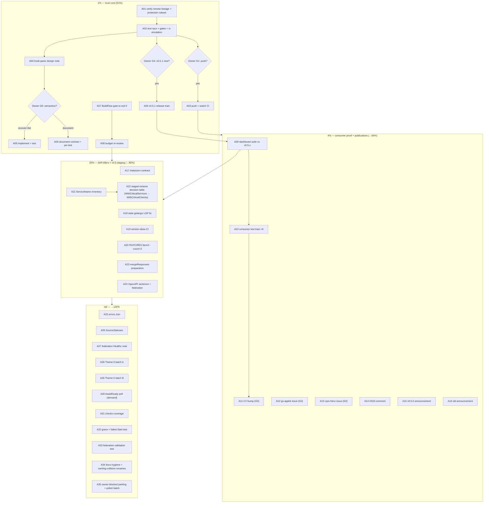

# Post-v0.5.0 Pareto Master Plan v2 — Verification, Consumer Proof, and the v0.6 Staging Plan

**Created:** 2026-10-09 14:49 CEST · **Status:** PLANNED — awaiting owner approval per repo precedent (the 2026-09-04 19:34 and 2026-10-02 16:11 plans both executed only after an explicit "get it done")
**Supersedes:** [2026-10-09_02-16_post-v050-verification-and-consumer-proof-pareto-master-plan.md](2026-10-09_02-16_post-v050-verification-and-consumer-proof-pareto-master-plan.md) (v1). v1's task universe is unchanged here; this revision applies the naming review's corrections ([docs/reviews/2026-10-09_02-42_naming-review.html](../reviews/2026-10-09_02-42_naming-review.html)) and folds in the deltas since 02:16. **No task was added, removed, or re-scoped except B114 (new, from the naming review); every A/B ID number from v1 is preserved.**
**Input universe:** every open TODO in the repo as of 2026-10-09 14:45 — TODO_LIST.md (18 rows), the live handoff reports (`docs/status/2026-10-08_20-58_*` §f/§g, `2026-10-08_20-59_*` §a–§g), the sweep report (`docs/status/2026-10-09_00-30_*` §f), the naming review, and the 04:09 session report. **No TODO is dropped; every one appears in both tracks below.**
**Method:** Pareto tiers (1% → 51%, 4% → 64%, 20% → 80%, tail → 100% — "tail" = the remaining 20% of result, reached last) × two granularity **tracks**: Track A = 35 deep tasks of 30–100 min, Track B = 114 micro-tasks of ≤12 min (107 physical rows; B036–B041 and B049–B051 are collapsed range rows). Every Track A row decomposes 1:1 into Track B rows. In this document "tier" always means impact share, never task size.

**Applied in this revision (from the naming review's fix order):** the three honesty fixes (C1 the "G3 spec" misnomer → "branch-protection ruleset spec"; C2 "four owner-blocked rows" → the three BLOCKED rows; C3 the false "sorted by impact, then effort" contract → "ordered by tier, then dependency chain"), the gate-namespace unification (H2: one G-table below; v1's Q1→G1, Q2→G4, Q3→G5), the Track/Tier axis split (H1), CV and fir expanded at first use (H4/L1), the `WithCriticalServices` → candidate `WithCriticalChecks` dual citation (H3 — v1's `Withn` was a mangled token; TODO_LIST's `WithCriticalChecks` names the rename **candidate**, the current option is `WithCriticalServices`), and the style passes (M1–M9, L2). Done alongside this revision: docs/INDEX.md gained the missing `docs/planning/` + `docs/reviews/` rows; TODO_LIST's CV row now carries the repo link.

> **Verschlimmbesser guards (non-negotiable)** — guards against well-meant worsening:
>
> 1. Every task below is **additive or decision-gated**. None touches the frozen wire format, the three-probe contract, or the v.x no-removal deprecation promise. Breaking renames execute ONLY inside the v0.6 window after A21/A22 land their inventory + decision table.
> 2. **Owner gates stay owner gates** — one namespace, defined once (v1 used two overlapping schemes; Q1/Q2/Q3 below map to G1/G4/G5):
>
> | Gate | Decision | Blocks |
> | ---- | -------- | ------ |
> | **G1** | Push master (incl. currently-unpushed local commits) | A03 |
> | **G2** | Upstream filing authority (go-appkit, cqrs-htmx issues) | A12, A13 |
> | **G3** | CV-bump authority (execute the bump in github.com/LarsArtmann/CV) | A11 |
> | **G4** | The v0.5.1 release decision (timing; Shutdown-hang + gosec fixes wait in `[Unreleased]`) | A06 |
> | **G5** | Hook-panic semantics (recover+fail-closed vs document-the-contract) | A05 implementation |
>
> 3. **Design note before feature** (repo rule since 2026-09-18): A04/A05, A27, A30 each start with a written decision, not code.
> 4. **Verify-before-filing + github-voice** for A12/A13/A14; **verify-before-claiming** everywhere: no "green" without the gate run behind it.
> 5. **No new dependencies** (single-dep policy), **no logging** (ADR-002), **stdlib errors** (ADR-001), CHANGELOG policy per CONTRIBUTING (library-consumer-facing changes only).
> 6. Gates before push, always: `nix run .#gates` + `.#ci-emulation` on the exact tree (A02), even after doc-only sessions.

---

## Pareto breakdown — what actually moves the needle

| Tier | Share of result | Tasks | Why this is the tier |
| ---- | --------------- | ----- | -------------------- |
| **1%** | **51%** | A01–A07 | The trust core: know what is actually on the remote (A01), prove the local bar before claiming anything (A02), ship the Shutdown-hang + gosec fixes to consumers (A06), close the real memory-safety-adjacent design hole in the hook seam (A04/A05), and make the newest quality gate (BuildFlow) tell the truth again (A07). Everything else inherits its credibility from this tier. |
| **4%** | **64%** | + A09–A16 | Proof + publications: the one deep consumer runs the released tag (A09), the fleet's six suites run it (A10), the double-stale consumer catches up (A11), and the two upstream filings plus three owner publications turn shipped work into adoption and reputation. |
| **20%** | **80%** | + A08, A17–A24 | The standing-drift killers and v0.6 staging: makezero contract (A17), the stale golangci LSP (A18), machine-checked fleet skew (A19), honest benchmark rows (A20), and the three v0.6 staging artifacts (A21–A23) + OpenAPI completeness (A24). Each removes a recurring per-session tax. |
| **Tail → 100%** | remaining 20% | A25–A35 + the three BLOCKED rows | ROADMAP Theme 6/7 features, test-depth items, hygiene, docs polish, and the three BLOCKED TODO rows (coverage-threshold policy, auditlog recorder decision, doanalyzerv2 go-directive floor — TODO_LIST "Blocked" sections). Real but deferrable without eroding trust. |

---

## Track A — 35 deep tasks, 30–100 min each (ordered by tier, then dependency chain)

| # | Tier | Task | Impact | Effort | Depends / gate | Covers (source rows) |
| - | ---- | ---- | ------ | ------ | -------------- | -------------------- |
| A01 | 1% | Verify remote lineage + branch-protection ruleset; correct manifest verdicts if the live config differs from the ruleset spec (5 required checks, linear history, admin bypass) | High | 30min | — | sweep §f1/§f21, 20:58 §c, §d8 |
| A02 | 1% | Local gate bar on the exact tree: `test-race` + `.#gates` + `.#ci-emulation` | High | 40min | A01 | sweep §f13, 22:37 §d2 lesson |
| A03 | 1% | Push master + verify CI on the pushed HEAD | High | 10min | A02, **G1** | 20:58 §f1, §g1 |
| A04 | 1% | Hook-panic design note: recover+fail-closed vs document-the-contract (`docs/panic-recovery-design.md` extension) | High | 45min | — (implementation needs G5) | TODO hook row, 09-15 §e6, sweep §f6 |
| A05 | 1% | Hook-panic implement + test per the A04 decision | High | 45min | A04, **G5** | same |
| A06 | 1% | v0.5.1 release train (CHANGELOG cut → gates → tag → proxy → pkg.go.dev → GitHub Release → doc sync) | High | 60min | A02, **G4** | 20:58 §f2/§g2, `[Unreleased]` |
| A07 | 1% | BuildFlow full-mode gate to exit 0 (skew verify, full run, binary rebuild, AGENTS update) | High | 90min | — | 20:59 §b1/§f1–15, TODO row |
| A08 | 20% | `.buildflow.yml` budget re-review (art-dupl 80 / branching-flow 14 / go-auto-upgrade 6) after A07 is green | Med | 30min | A07 | 20:59 §e7, sweep §f46 |
| A09 | 4% | go-health-dashboard full suite vs released v0.5.x (incl. screenshot tests) | High | 40min | A06 ideally | TODO row, 20:58 §f3 |
| A10 | 4% | Consumer test train vs the tag: file-and-image-renamer (fir), KeyHolderAI, DiscordSync, go-taskqueue, webphone, nsfw-classifier | Med | 60min | A06 ideally | TODO row, sweep §f8 |
| A11 | 4% | CV bump — [github.com/LarsArtmann/CV](https://github.com/LarsArtmann/CV) (enterprise CV/resume generator) to go-health v0.5.x + `go 1.27` floor | Med | 45min | **G3** | TODO row, 10-03 §f5 |
| A12 | 4% | File go-appkit/health detailed-probe issue (verify-before-filing + github-voice) | High | 30min | **G2** | TODO row, 10-03 §f2 |
| A13 | 4% | File cqrs-htmx/health detailed-recorder issue (same discipline) | High | 30min | **G2** | TODO row, 10-03 §f3 |
| A14 | 4% | Post samber/do#318 comment (re-verify line numbers on master first) | Med | 10min | owner | TODO row |
| A15 | 4% | Publish the v0.5.0 announcement (channels checklist ready) | Med | 15min | owner | 19:42 §a3, sweep §f11 |
| A16 | 4% | Publish the v0.1.1/v0.1.2 announcement (draft ready since 09-04) | Low | 15min | owner | TODO row |
| A17 | 20% | Pin down the makezero `always` contract; record it in AGENTS + a `.golangci.yml` comment | Med | 30min | — | TODO row, 20:58 §f4 |
| A18 | 20% | Fix or disable the stale golangci LSP integration | Med | 30min | — | TODO row, 20:58 §f19 |
| A19 | 20% | Version-skew CI script: fleet go.mod pins vs latest tag, fail-on-drift | Med | 45min | — | TODO row, R14 |
| A20 | 20% | FEATURES benchmark re-verify at fresh `-count=3`; label single-run rows | Med | 60min | — | TODO row, sweep §f24 |
| A21 | 20% | ServiceName call-site inventory + mechanical rewrite script (v0.6 staging) | High | 60min | — | TODO row, R6 |
| A22 | 20% | Staged-rename decision table — current `WithCriticalServices` → candidate `WithCriticalChecks`, plus `SanitizeResponse`→`CoerceValidUTF8`, `Since`→`StatusSince` | Med | 40min | A21 helpful | TODO row, R7, naming-integrity.md |
| A23 | 20% | mergeResponses port preparation: primitive sketch + corpus fixture | Med | 50min | — | TODO row, R11 |
| A24 | 20% | OpenAPI: Healthz-mount sentence + federation endpoint coverage + lockstep/redocly verify | Med | 60min | — | sweep §f36, 19:51 §f11, ROADMAP |
| A25 | tail | `errors.Join` in `aggregate.New` (design + spike ready) | Med | 60min | — | ROADMAP Theme 7, 10-03 §f7 |
| A26 | tail | `Aggregate.SourceStatuses()` (design ready) | Med | 60min | — | ROADMAP Theme 7 |
| A27 | tail | federation `Prober.Healthz()` parity design note (implementation stays next-minor) | Low-Med | 45min | — | ROADMAP Theme 7 |
| A28 | tail | Theme 6 batch A: golden-fixture fuzz seeds + `-count=N` race-stress CI step | Low | 60min | — | ROADMAP Theme 6 |
| A29 | tail | Theme 6 batch B: throttled-contention bench + throttle-boundary fuzz + handler-fuzz × throttle/cache modes | Low | 90min | — | ROADMAP Theme 6 |
| A30 | tail | `AwaitReady` cache-aware poll interval (mini design note first; demand-gated) | Low | 60min | use case | ROADMAP Theme 1 |
| A31 | tail | `health/checks` coverage-close report + top-gap fixes | Low-Med | 30min | — | 10-03 §f40 |
| A32 | tail | `WithShutdownGracePeriod` × failed-`Start` interaction test (disarm path) | Low-Med | 30min | — | 19:42 §f48 |
| A33 | tail | Federation-adjacent `ErrUnknownCriticalService` composition test (mirror of the aggregate one) | Low | 30min | — | 19:42 §f49 |
| A34 | tail | Docs hygiene batch: `docs/**` link sweep + `.config`/`reports`/`coverage`/`result` inspection + trash stale + naming-collision renames | Low | 30min | — | sweep §f43/§f45, 20:59 §c8, naming review L-items |
| A35 | tail | Owner-blocked deep items parked with evidence: doanalyzerv2 floor (patch-pin), auditlog recorder (ADR-004), coverage threshold; plus formatting pass + lessons.md reconcile + process-metrics fate | Low | 30min+ | owner decisions | TODO BLOCKED rows, 13-13 §c3 |

_Explicitly out of Track A scope (standing/deferred by design): adoption-matrix re-verify (release-time ritual), fuzz-long watch (calendar event 2026-10-12), post-answer audit (after the owner answers). They exist as Track B micro-rows so nothing is lost._

---

## Track B — 114 micro-tasks, ≤12 min each (all TODOs decomposed; 107 physical rows, sorted within parent by execution order)

| ID | Parent | Micro-task (≤12 min) | Verify |
| -- | ------ | -------------------- | ------ |
| B001 | A01 | `git fetch origin && git log --oneline origin/master -15` — reconcile what actually landed vs the 20:58 report's "10 ahead" | lineage table matches remote |
| B002 | A01 | `gh api repos/LarsArtmann/go-health/branches/master` — dump full protection config (checks, linear history, enforce_admins) | config captured |
| B003 | A01 | Compare against the branch-protection ruleset spec (5 required checks + linear history + admin bypass); patch the archived-README manifest + sweep-report §d8 verdict with a correction note if it differs | manifest consistent |
| B004 | A02 | `nix run .#test-race` | 4/4 ok |
| B005 | A02 | `nix run .#gates` (background, ~10 min) — read the FULL output, not the exit code | every gate named green |
| B006 | A02 | `nix run .#ci-emulation` (go-free PATH) | exit 0 |
| B007 | A03 | Push master (**G1**) | `git status -sb` in sync |
| B008 | A03 | Watch CI on the pushed HEAD; record the run ID in the next status note | CI success |
| B009 | A04 | Re-read docs/panic-recovery-design.md (recoverable vs process-fatal surfaces) | design context loaded |
| B010 | A04 | Write the two options with failure semantics (loop-dead vs synthesized fail row) | draft section exists |
| B011 | A04 | Recommend one; list the classification/cache consequences of each | recommendation + rationale |
| B012 | A04 | Add the decision block to the design doc; commit | design doc updated |
| B013 | A05 | Implement the chosen semantics in probe.go (recover site at the hook call) | builds |
| B014 | A05 | Test: panicking hook does not kill the loop / produces the decided signal | new test green |
| B015 | A05 | Race + lint + classify-matrix re-run | gates green |
| B016 | A05 | CHANGELOG entry (consumer-facing behavior) + AGENTS panic paragraph sync | docs-check green |
| B017 | A06 | CHANGELOG `[Unreleased]` → `[v0.5.1]` cut + compare links (**G4**) | docs-check green |
| B018 | A06 | go.mod hygiene greps (no replace, no pseudo-versions) | clean |
| B019 | A06 | `nix run .#gates` on the release tree | all green |
| B020 | A06 | Annotated tag + push master + tag | `git tag --points-at` |
| B021 | A06 | Proxy `.info` hash check + pkg.go.dev render poll | hash matches tag commit |
| B022 | A06 | `gh release create` (not prerelease, Latest, curated notes) | release page live |
| B023 | A06 | Post-release doc sync: README/AGENTS stability lines, doc.go, TODO header | docs-check green |
| B024 | A07 | `BUILDFLOW_NO_RESULT_CACHE=1 buildflow -s govalid-generate --verbose` — confirm the 1.27.1 revert cleared the skew | step green |
| B025 | A07 | Full `buildflow --fix --build-mode=full` — demand exit 0 + findings gate evaluated | exit 0 |
| B026 | A07 | Rebuild the BuildFlow binary (`nix build . && nix run .#reinstall` in that repo) | doctor stops warning |
| B027 | A07 | Verify golangci [tools/doanalyzerv2] + govulncheck both modules content-wise | 0 findings |
| B028 | A07 | AGENTS BuildFlow gotcha updated with the resolution + the makezero seam note | AGENTS accurate |
| B029 | A08 | art-dupl budget 80: sample 10 findings, confirm test-similarity class | accept/adjust recorded |
| B030 | A08 | branching-flow budget 14: re-check the 5-by-refactor reductions still hold | budget ≤ 14 justified |
| B031 | A08 | go-auto-upgrade budget 6: confirm samber/lo absence is still deliberate | recorded |
| B032 | A09 | Dashboard: baseline suite on the current pin before bumping | suite green |
| B033 | A09 | `go get go-health@v0.5.x && go mod tidy && go mod verify` | go.mod sane |
| B034 | A09 | Full suite + browser-backed screenshot tests | green incl. screenshots |
| B035 | A09 | Push/CI handoff note for that repo (per the cross-repo rule) | note exists |
| B036–B041 | A10 | Per repo (file-and-image-renamer (fir), KeyHolderAI, DiscordSync, go-taskqueue, webphone, nsfw-classifier): bump to the tag, run focused go-health tests, record result (10 min each) | 6/6 results table |
| B042 | A10 | Write the train summary into the TODO row's evidence cell; delete or keep the row per result | TODO_LIST honest |
| B043 | A11 | CV: `go get go-health@v0.5.x` + directive `go 1.27` (**G3**) | go.mod updated |
| B044 | A11 | Build + health-suite run in CV | green |
| B045 | A11 | Flake/nix targets verify + push decision note | no skew left |
| B046 | A12 | Re-verify the go-appkit draft against current go-appkit source (API drift?) | draft still true |
| B047 | A12 | github-voice pass over the issue body | 0 FAIL / 0 WARN |
| B048 | A12 | File the issue; link it from the bridge-golden-path doc + TODO row | issue URL recorded |
| B049–B051 | A13 | Same three steps for the cqrs-htmx/health draft | issue URL recorded |
| B052 | A14 | Re-verify samber/do master line numbers cited in the #318 draft | citations current |
| B053 | A14 | Post the comment; delete the TODO row; record the permalink | TODO_LIST updated |
| B054 | A15 | Work the v0.5.0 announcement channels checklist (**owner**) | posted |
| B055 | A16 | Same for the v0.1.1/v0.1.2 announcement (**owner**) | posted |
| B056 | A17 | Write a 15-line probe program: pre-sized inline slice vs local var vs append | behavior observed |
| B057 | A17 | Read makezero's rule docs/source for `always` | contract understood or honestly bounded |
| B058 | A17 | Write the contract (or the open question, bounded) into AGENTS + `.golangci.yml` comment | docs-check green |
| B059 | A18 | Reproduce the panel's 3 false warnings against a real `nix run .#lint` | evidence captured |
| B060 | A18 | Fix the integration config or disable it; document the choice in AGENTS | panel silent or accurate |
| B061 | A19 | Write the go.mod pin-parsing sweep script | parses the fleet |
| B062 | A19 | Fleet pins table vs latest tag | table generated |
| B063 | A19 | CI workflow step + failure path (deliberate skew → red) | drift fails CI |
| B064 | A20 | Benchmarks: root package `-count=3` | 3 runs captured |
| B065 | A20 | Benchmarks: aggregate + checks `-count=3` | 3 runs captured |
| B066 | A20 | Medians + spread computed; FEATURES table updated; single-run rows labeled | table honest |
| B067 | A21 | Grep the fleet for `health.New`/constructor call sites | raw list |
| B068 | A21 | Normalize into the per-repo inventory table | table in servicename-design |
| B069 | A21 | Mechanical rewrite script + dry-run diff on one consumer | diff sane |
| B070 | A21 | Verification plan (per-repo test command list) | plan written |
| B071 | A22 | Pull the staged renames from docs/naming-integrity.md (current names first: `WithCriticalServices`, `SanitizeResponse`, `Since`) | list current |
| B072 | A22 | Per-rename consumer-impact column (who breaks, how loud) | table complete |
| B073 | A22 | `WithCriticalServices` → `WithCriticalChecks`: alias-vs-rename decision row | decision recorded |
| B074 | A22 | Cross-link the table from TODO_LIST v0.6 section | TODO current |
| B075 | A23 | Sketch the `mergeResponses` primitive signature against both merge sites | signature draft |
| B076 | A23 | Corpus fixture from the aggregate golden + federation samples | fixture exists |
| B077 | A23 | Property-suite port plan (which assertions move, which stay) | plan written |
| B078 | A23 | Update merge-unification-design.md status + TODO row | docs-check green |
| B079 | A24 | Spec: document the mountable single-endpoint `Healthz()` (root + aggregate) | spec updated |
| B080 | A24 | Spec: federation paths/schemas | spec updated |
| B081 | A24 | Redocly lint + `nix run .#openapi-lockstep` green | both pass |
| B082 | A24 | `info.version` bump decision recorded | decision noted |
| B083 | A25 | Implement `errors.Join` in aggregate.New per the design | tests green |
| B084 | A25 | Multi-error construction tests + CHANGELOG + design-doc status flip | complete |
| B085 | A26 | Implement `SourceStatuses()` + property test against per-source roll-ups | property green |
| B086 | A26 | Docs (README aggregate section + FEATURES row) + CHANGELOG | docs-check green |
| B087 | A27 | federation Healthz parity design note: 503 conditions + latch semantics | note written |
| B088 | A27 | Enforcement plan + ROADMAP cross-link; do NOT implement | ROADMAP updated |
| B089 | A28 | Golden-fixture inputs → aggregate fuzz seed corpus | corpus loads |
| B090 | A28 | `-count=N` race-stress CI step (conditional on zero flakiness) | CI green |
| B091 | A29 | Throttled live-path benchmark under contention + baseline recorded | FEATURES row |
| B092 | A29 | Throttle-window boundary fuzz (fake clock) | fuzz PASS |
| B093 | A29 | Aggregate handler fuzz × throttle/cache modes | fuzz PASS |
| B094 | A30 | Mini design note for the cache-aware poll interval | note written |
| B095 | A30 | Implement + test (ONLY on a concrete consumer need) | gated |
| B096 | A31 | `go test -cover ./checks` + gap list | report exists |
| B097 | A31 | Close the top gaps; re-measure | coverage up |
| B098 | A32 | Write the grace × failed-Start interaction test | test green |
| B099 | A33 | Write the federation-adjacent validation composition test | test green |
| B100 | A34 | Link sweep over docs/** (fences skipped); triage hits | 0 real breaks |
| B101 | A34 | Inspect `.config/`, `reports/`, `coverage/`, stale `result` symlink; trash stale | tree clean |
| B102 | A35 | Owner-blocked set parked: doanalyzerv2 floor (**owner**), auditlog decision (**owner**), coverage threshold (**owner**) — refresh evidence cells, do not implement | TODO honest |
| B103 | A35 | dprint/markdownlint pass over the sweep-edited markdown; decide CI role | formatting settled |
| B104 | A35 | Read references/lessons.md; reconcile the fleet/process recommendations | no duplicate lessons |
| B105 | A35 | Record the process-metrics thread fate (measure or retire) | decision recorded |
| B106 | A35 | Standalone go-structure-linter re-run after the AGENTS restructure | 0 findings / cap OK |
| B107 | A35 | `feature_request.md` blob render check on github.com | link renders |
| B108 | A35 | Fix doanalyzerv2 main.go doc comment + sweep stale module-path references | 0 stale refs |
| B109 | A35 | README GOTOOLCHAIN=auto note + compat table re-check | README updated |
| B110 | A35 | CONTRIBUTING: keep-window policy + completion-note convention for live reports | CONTRIBUTING updated |
| B111 | A35 | Backfill the completion note on the 20:58 report (parity with 20:59) | convention consistent |
| B112 | A35 | Watch fuzz-long 4-target run (2026-10-12) + corpus-artifact verify | run green |
| B113 | A35 | Post-answer docs-health re-audit (after G1/G4/G5 land) | TODO reshaped, scores fresh |
| B114 | A34 | Rename the "(CV)" environment-conditional-sets abbreviation in docs/start-validation-design.md to "conditional sets" (collides with the CV consumer repo) | 0 CV collisions in design docs |

_No micro-task exceeds 12 minutes; the two long-running commands (full gates, full BuildFlow run) are single dispatches with background execution and a read-the-full-output verify step._

---

## Execution graph

---

## Definition of done (per task class)

- **Code tasks (A05, A25, A26, A30…):** tests + race + lint green, design-doc status flipped, CHANGELOG entry if consumer-facing, docs-check green.
- **Release tasks (A06):** every go-release phase green BEFORE the next (gates → CI on the exact commit → tag → proxy → pkg.go.dev → GitHub Release → doc sync); staleness grep is a PRE-tag step.
- **Verification tasks (A01, A02, A09, A10, A20):** the artifact is a recorded output (run log, results table, medians), never a claim.
- **Doc tasks:** `nix run .#docs-check` + link sweep green; every count derived from the filesystem, never from memory.
- **Owner-gated rows:** the plan prepares evidence; the row moves only when the owner's answer lands in TODO_LIST.
